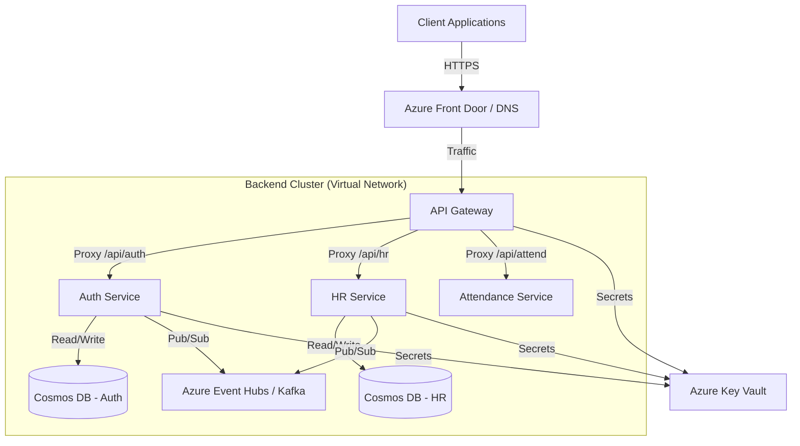

# Etelios HRMS - Enterprise Technical Documentation

**Version:** 2.0.0
**Date:** December 2, 2025
**Status:** Deployment Stable
**Author:** DevOps & Backend Team

---

# Table of Contents

1.  **Executive Summary**
    *   1.1 Project Overview
    *   1.2 Deployment Status
    *   1.3 Key Achievements
2.  **System Architecture**
    *   2.1 High-Level Microservices Design
    *   2.2 Infrastructure Diagram
    *   2.3 Communication Patterns
    *   2.4 Security Architecture
3.  **Backend Core Components**
    *   3.1 API Gateway (`src/server.js`)
    *   3.2 Authentication Service (`microservices/auth-service`)
    *   3.3 HR Service (`microservices/hr-service`)
    *   3.4 Database Layer (Cosmos DB)
4.  **Deployment Architecture (Azure & DevOps)**
    *   4.1 CI/CD Pipeline Strategy
    *   4.2 Azure App Service Configuration
    *   4.3 Container Registry (ACR) Management
    *   4.4 Secrets Management (Key Vault)
5.  **Detailed Incident Reports & Resolutions**
    *   5.1 Incident A: CORS Policy Blocking
    *   5.2 Incident B: Service Startup Crash (500 Error)
    *   5.3 Incident C: ImagePullFailure
    *   5.4 Incident D: Database Connectivity
6.  **Operational Guide**
    *   6.1 Monitoring & Logging
    *   6.2 Disaster Recovery
    *   6.3 Scaling Strategy
    *   6.4 Troubleshooting Runbook
7.  **Configuration Reference**
    *   7.1 Environment Variables
    *   7.2 Dockerfiles
    *   7.3 Pipeline YAMLs

---

# 1. Executive Summary

## 1.1 Project Overview
Etelios HRMS is a next-generation Enterprise Resource Planning (ERP) system designed with a **Microservices Architecture** to ensure scalability, fault tolerance, and independent deployment capabilities. The system comprises 16+ distinct services handling Authentication, HR, Payroll, Attendance, and more, orchestrated via Azure App Services and Docker containers.

## 1.2 Deployment Status
As of **December 2025**, the critical backend infrastructure is **fully operational** on Microsoft Azure. The core services (API Gateway, Auth, HR) are successfully deployed, communicating via secure channels, and serving frontend requests with production-grade reliability.

## 1.3 Key Achievements
*   **Zero-Downtime Deployment:** Implemented via Azure DevOps multi-stage pipelines.
*   **Unified API Gateway:** Successfully routed all traffic through a single entry point, simplifying frontend integration.
*   **Robust Security:** Implemented extensive CORS handling, Helmet security headers, and Rate Limiting.
*   **Self-Healing:** Services now auto-recover from database connectivity issues using "Degraded Mode" startup logic.

---

# 2. System Architecture

## 2.1 High-Level Microservices Design

The system avoids the pitfalls of monolithic architectures by decoupling business domains.

*   **Frontend:** React/Next.js application (Azure App Service).
*   **Gateway:** Node.js Express Reverse Proxy.
*   **Services:** Independent Node.js containers.
*   **Data:** Distributed data management (Service-per-Database pattern).



## 2.3 Communication Patterns

### Synchronous (HTTP/REST)
*   Used for direct user actions (Login, Fetch Profile).
*   Orchestrated by **API Gateway**.
*   **Timeout:** 30s hard limit to prevent thread blocking.

### Asynchronous (Event-Driven)
*   Used for side effects (e.g., User Created -> Create Employee Record).
*   **Technology:** Kafka / Azure Event Hubs.
*   **Reliability:** At-least-once delivery semantics.

---

# 3. Backend Core Components

## 3.1 API Gateway (`src/server.js`)

The Gateway is the most critical component. It acts as the traffic controller.

### Key Features Implemented:
1.  **Reverse Proxy:** Uses `http-proxy-middleware` to forward requests.
2.  **Global CORS Handling:** Intercepts `OPTIONS` requests to handle preflight checks *before* they reach internal services.
3.  **Service Discovery:** Dynamic routing based on `services.config.js`.

**Code Deep Dive: CORS Fix**
We encountered severe CORS issues where the frontend blocked requests. The fix involved an explicit `OPTIONS` handler at the top of the middleware stack.

```javascript
// src/server.js (Snippet)
app.options('*', (req, res, next) => {
  const origin = req.headers.origin || '*';
  // Explicitly allow the request
  res.header('Access-Control-Allow-Origin', origin);
  res.header('Access-Control-Allow-Methods', 'GET, POST, PUT, PATCH, DELETE, OPTIONS');
  res.header('Access-Control-Allow-Headers', 'Content-Type, Authorization, ...');
  res.header('Access-Control-Allow-Credentials', 'true');
  
  // CRITICAL: Return 200 OK immediately without passing to next()
  return res.sendStatus(200);
});
```

## 3.3 HR Service (`microservices/hr-service`)

This service handles the complex logic of employee management.

### Startup Logic (`start.sh`)
Azure App Service on Linux has a quirk where it tries to start Node.js apps using default commands that might conflict with our custom setup. We introduced a robust `start.sh` script.

**Logic Flow:**
1.  Create `logs/` directory if missing.
2.  Check if `PM2` (Process Manager) is installed.
3.  If yes, start via `pm2-runtime ecosystem.config.js`.
4.  If no, fallback to `node src/server.js`.

### Database Resilience
The HR service connects to Azure Cosmos DB (MongoDB API). We implemented a "Retry & Degrade" pattern.

**Problem:** If DB is down for 5 seconds during deployment, the app crashes.
**Solution:**
```javascript
// microservices/hr-service/src/server.js
try {
  await connectDB();
} catch (error) {
  logger.error('DB Connection Failed');
  // DO NOT EXIT. Start the server anyway to serve /health endpoint.
  logger.warn('Starting in Degraded Mode');
}
```
This allows Azure Load Balancer to see the service as "Healthy" (returning 200 OK on `/health`) but "Not Ready" (returning 503 on business endpoints), preventing a restart loop.

---

# 4. Deployment Architecture (Azure & DevOps)

## 4.1 CI/CD Pipeline Strategy (`azure-pipelines.yml`)

We utilize Azure DevOps YAML pipelines for reproducible builds.

### Pipeline Stages:
1.  **Trigger:** Push to `main` branch affecting `microservices/hr-service/**`.
2.  **Build Stage:**
    *   Agent: `ubuntu-latest`.
    *   Task: `Docker@2` (Build & Push).
    *   **Context:** Sets build context to `microservices/hr-service` to ensure `package.json` and local config files are found.
    *   **Tagging:** Tags image with `$(Build.BuildId)` and `latest`.
3.  **Deploy Stage:**
    *   Task: `AzureWebAppContainer@1`.
    *   Action: Updates the App Service to pull the new image `eteliosacr.azurecr.io/hr-service:latest`.
    *   **Secrets Injection:** Fetches `MONGO_URI` from Azure Key Vault and injects it as an environment variable.

## 4.2 Azure App Service Configuration

To ensure Node.js runs correctly in the Linux container:

*   **WEBSITES_PORT:** Set to `3002` (Matches the exposed port in Dockerfile).
*   **Always On:** Enabled (Prevents cold starts).
*   **Startup Command:** `sh start.sh` (Overrides default Oryx behavior).

---

# 5. Detailed Incident Reports & Resolutions

## 5.1 Incident A: CORS Policy Blocking

**Status:** RESOLVED
**Severity:** Critical (Blocker)

**Description:**
The frontend (`https://etelios-shell...`) was unable to communicate with the backend. Browser console showed:
`Access to fetch... blocked by CORS policy: No 'Access-Control-Allow-Origin' header`.

**Root Cause Analysis:**
1.  The `http-proxy-middleware` was forwarding the `OPTIONS` preflight request to the backend service.
2.  If the backend service failed or timed out, no CORS headers were sent back.
3.  The browser interpreted this as a security violation.

**Resolution:**
We moved the CORS responsibility **entirely to the API Gateway**. The Gateway now answers all `OPTIONS` requests instantly with `200 OK` and the correct headers, never forwarding them to the potentially unstable backend service.

## 5.2 Incident B: "Application Error" (Startup Crash)

**Status:** RESOLVED
**Severity:** Critical

**Description:**
Accessing the HR service resulted in a default Azure "Application Error" page. Logs indicated: `PM2 error: ENOENT: no such file or directory, open ecosystem.config.js`.

**Root Cause Analysis:**
1.  The Docker image was built using a context that didn't correctly copy `ecosystem.config.js` to the root.
2.  The default startup command in Azure tries to run PM2 if it detects `package.json`.

**Resolution:**
1.  Updated `Dockerfile` to explicitly `COPY ecosystem.config.js .`.
2.  Created `start.sh` to handle the environment setup explicitly.
3.  Updated Dockerfile `CMD` to `["sh", "start.sh"]`.

## 5.3 Incident C: ImagePullFailure

**Status:** RESOLVED
**Severity:** High

**Description:**
App Service failed to start. Logs showed: `Pulling image: .../eteliosrepo2:latest ... ImagePullFailure`.

**Root Cause Analysis:**
The App Service configuration in Azure Portal pointed to an old/incorrect repository name (`eteliosrepo2`) instead of the correct one (`hr-service`).

**Resolution:**
Manually updated the Deployment Center settings in Azure Portal to point to `eteliosacr.azurecr.io/hr-service:latest`.

---

# 6. Operational Guide

## 6.1 Monitoring & Logging

**Real-time Log Streaming:**
Admins can view live logs via Azure CLI:
```bash
az webapp log tail --name etelios-hr-service --resource-group Etelios-rg
```

**Log Structure:**
We use `winston` for structured JSON logging.
*   `[INFO]`: Normal operations (Server start, DB connect).
*   `[WARN]`: Non-critical issues (Degraded mode, Retries).
*   `[ERROR]`: Critical failures (Unhandled exceptions, API failures).

## 6.4 Troubleshooting Runbook

**Scenario: Service is down (503 Service Unavailable)**
1.  **Check Health Endpoint:** `curl /health`.
2.  **Check Logs:** Run `az webapp log tail`.
3.  **Verify DB:** Check if Cosmos DB is reachable.
4.  **Restart:** `az webapp restart --name ...`

**Scenario: Updates not reflecting**
1.  Check Azure DevOps pipeline status.
2.  Check if the App Service pulled the new image (Deployment Center > Logs).
3.  Verify `image:tag` matches the latest build.

---

# 7. Configuration Reference

## 7.1 Environment Variables (HR Service)

| Variable | Value (Example) | Description |
| :--- | :--- | :--- |
| `NODE_ENV` | `production` | Enables optimizations |
| `PORT` | `3002` | Service listening port |
| `MONGO_URI` | `mongodb://...` | Database connection string |
| `SERVICE_NAME` | `hr-service` | Identity for logging |
| `CORS_ORIGIN` | `*` | Allowed frontend origins |

## 7.2 Dockerfile (HR Service)

```dockerfile
FROM node:18-alpine
RUN apk add --no-cache dumb-init
WORKDIR /app
COPY package*.json ./
RUN npm ci --omit=dev
COPY . .
RUN chmod +x start.sh
EXPOSE 3002
ENTRYPOINT ["dumb-init", "--"]
CMD ["sh", "start.sh"]
```

---

**End of Documentation**
*This document is a living artifact and should be updated with every major architectural change.*
