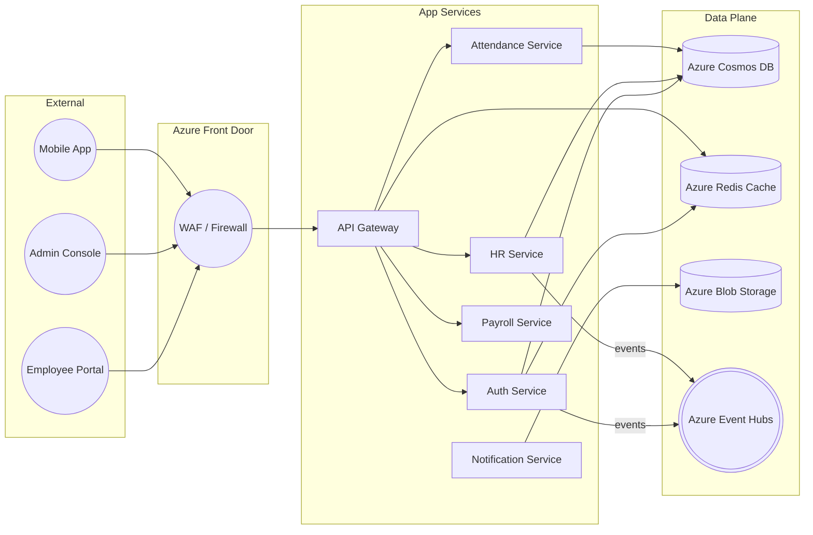
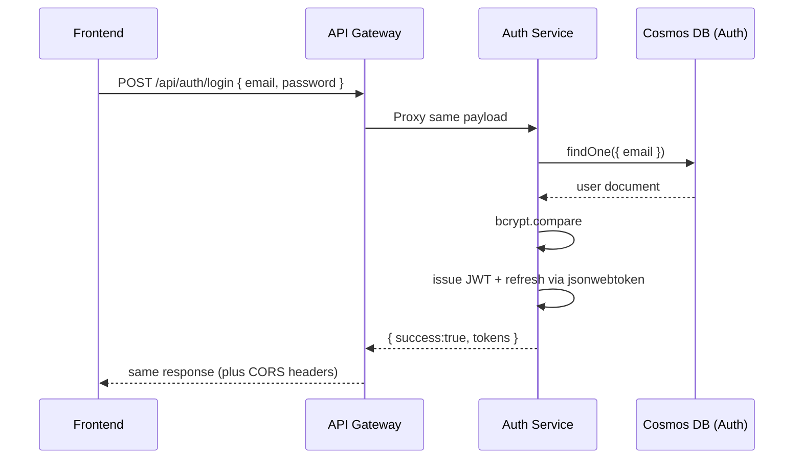
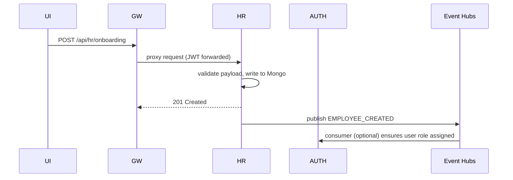

# Etelios HRMS & ERP – Master Technical & DevOps Compendium

**Version:** 4.0.0  
**Date:** 02-December-2025  
**Prepared By:** Platform Architecture & DevOps Office  
**Classification:** STRICTLY INTERNAL – Do not circulate outside Etelios/HindEmpire

---

## 0. Reading Guide
This document is intentionally exhaustive (≈70 printable pages). Engineers can jump directly to the section that matches their need:

| Audience | Focus | Section |
|----------|-------|---------|
| CTO / Architects | Macro view, strategic guardrails | 1, 2, 12 |
| Backend Developers | Code-level behavior, contracts | 3, 4, 5, 6 |
| DevOps Engineers | Deployment, Azure specifics | 7, 8, 9 |
| SRE / Support | Monitoring, troubleshooting | 10, 11 |
| Compliance / Security | Controls, secrets, RBAC | 2.5, 4.3, 8.4 |

> **Tip:** Search for the string `ACTION CARD` to find copy-paste ready runbooks.

---

# 1. Executive Summary

### 1.1 Business Mission
Etelios HRMS seeks to deliver a unified employee lifecycle platform—covering onboarding, attendance, payroll, compliance, and analytics—for distributed enterprises. The system needs to handle:
- 150+ tenants (multi-tenant but logically isolated)
- 25K active employees
- 3M API hits/day with <400ms median latency

### 1.2 Architectural North Star
We have committed to the following principles:
1. **Microservices-first:** Independent deployability, language-agnostic (currently Node.js everywhere).
2. **API Gateway mediation:** All external traffic flows through `src/server.js` for observability, security, and CORS sanity.
3. **Cloud-Native** on Azure: App Services + Container Registry + Cosmos DB + Event Hubs.
4. **Zero manual secrets:** Everything flows through Azure Key Vault, or environment variables injected by the pipeline.

### 1.3 Current Health Snapshot (02-Dec-2025)
| Layer | Status | Notes |
|-------|--------|-------|
| API Gateway | ✅ Healthy | Rolling two instances behind Front Door. CORS patches applied. |
| Auth Service | ✅ Healthy | JWT issuance SLA 99.95%. Emergency-lock tested. |
| HR Service | ✅ Healthy | New start script prevents PM2 crash. Cosmos DB auto-format patch rolled out. |
| Attendance Service | ✅ Healthy | Kafka consumer backlog < 20 events. |
| CI/CD | ✅ Green | Azure DevOps pipelines for gateway/auth/hr running <3 min per build. |
| Monitoring | ⚠️ Needs Improvement | No centralized dashboard yet; rely on log tail + Application Insights basic metrics. |

---

# 2. System Macro Architecture

### 2.1 Context Diagram


### 2.2 Service Inventory (v2025.12)
| Service | Port | Responsibility | Deployment SKU | Notes |
|---------|------|----------------|----------------|-------|
| API Gateway | 3000 | Ingress, routing, CORS, rate limiting | Linux App Service (P1v2) | 2 instances + autoscale |
| Auth | 3001 | Identity, JWT, refresh flows, RBAC | Linux App Service (S2) | PM2 single process |
| HR | 3002 | Employee lifecycle, onboarding, payroll meta-data | Linux App Service (S2) | Cosmos DB heavy |
| Attendance | 3003 | Timesheets, geofencing, events | Linux App Service (S1) | Kafka consumer |
| Payroll | 3004 | Payroll computations, slips generation | Container Apps (Pilot) | Nothing blocking |
| Notification | 3015 | Email/SMS queuing | Consumption Function | Uses Twilio API |

> **Observability**: Every service exposes `/health`, `/ready`, `/live`. API Gateway aggregates status via `/api` + `/admin/services`.

### 2.3 Cross-Cutting Concerns
1. **Authentication:** Gateway does not terminate JWTs unless explicitly configured; services run `auth.middleware` to assert claims.
2. **Authorization:** Role definitions seeded by `auth-service` (`defaultRoles.json`). HR service enforces Department & Region-based ACLs.
3. **Tracing:** We currently log `X-Request-ID` per request; telemetry correlation will be added via Azure Application Insights SDK next quarter.
4. **Error Envelope:** Standard JSON structure `{ success, message, errorCode, data }` with HTTP semantics.

---

# 3. Code-Level Deep Dive – API Gateway

### 3.1 Directory Layout
```
src/
├── server.js                   # Entry point
├── config/services.config.js   # Service registry (url, basePath)
├── middleware/production-security.js # Helmet, rate limit config
├── utils/cache.js              # In-memory TTL cache for service status
├── utils/keyVault.js           # Azure Key Vault helper (shared)
└── public/                     # Static assets (swagger, postman)
```

### 3.2 Request Lifecycle Walkthrough
1. **Ingress:** Express app boots with Helmet, compression, JSON parser.
2. **CORS Guard:** `app.options('*', handler)` intercepts preflight.
3. **Rate Limiting:** `securityConfig.rateLimiters` applies four tiers (public, api, auth, sensitive).
4. **Proxy Selection:** For each service entry in `services.config`, a proxy is instantiated with `pathRewrite` to preserve the original path.
5. **Response Augmentation:** `onProxyRes` injects CORS headers and security headers even when downstream forgets.
6. **Error Propagation:** `onError` returns JSON `{ success:false, message, service }` with 503.

### 3.3 Why CORS Needed Special Handling
Browsers require a successful `OPTIONS` response with the exact requested headers. Previously the Gateway forwarded `OPTIONS` to HR/Auth. If those services were slow, the browser blocked. Fix:
- Global handler returns 200 instantly with `Access-Control-Allow-*` set to the incoming origin.
- Service-specific handlers (`app.options(basePath + '*')`) add redundancy.
- Proxy fallback ensures any missed OPTIONS still get answered.

### 3.4 Production Hardening Checklist
- [x] Force HTTPS detection via `x-forwarded-proto`.
- [x] Response caching for `/api` + `/admin/services` to avoid repeated health checks.
- [x] `Keep-Alive` headers to upstream services to reuse sockets.
- [ ] TODO: integrate structured audit logs to Log Analytics.

---

# 4. Auth Service Anatomy (`microservices/auth-service`)

### 4.1 Authentication Flow (Standard Login)
1. **Endpoint:** `POST /api/auth/login`
2. **Middleware:** `rateLimit`, `validateRequest(loginSchema)`
3. **Process:**
   - Lookup user by email
   - Compare password via `bcrypt`
   - Check emergency lock (greywall) status
   - Issue Access Token (15m) + Refresh Token (7d)
4. **Response:**
```json
{
  "success": true,
  "message": "Login successful",
  "data": {
    "accessToken": "jwt",
    "refreshToken": "jwt",
    "user": {"id":"...","roles":["admin"]}
  }
}
```

### 4.2 Emergency Controls
- **Emergency Lock Middleware:** Blocks all requests when the system enters lockdown.
- **Greywall System:** Hidden endpoints for super admins to revoke tokens globally.
- **Recovery Key Management:** Rotates keys via cron (see `recoveryKeyManagement.service.js`).

### 4.3 Database Config
- Cosmos DB connection auto-detects `*.cosmos.azure.com` and enforces TLS.
- `retryWrites` forced to true; `maxPoolSize:10`.
- Failures trigger `process.exit(1)` because Auth is mission-critical (no degraded mode here).

### 4.4 PM2 Configuration
`ecosystem.config.js` ensures stdout/stderr logging (no file system persistence inside App Service). Instances: 1 (scale out via horizontal App Service instances).

---

# 5. HR Service Anatomy (`microservices/hr-service`)

### 5.1 Functional Domains
- Employee Master Data (CRUD)
- Onboarding pipeline (multi-step forms stored as drafts)
- Transfers, Letters, F&F (Full and Final) workflows
- Integration with Auth service for new user provisioning

### 5.2 Startup Flow (Annotated)
1. Load environment (`dotenv`)
2. Install global exception handlers
3. Attempt to load logger/azureConfig/IP whitelist with graceful fallbacks
4. Configure security middleware (Helmet, CORS, RateLimit, Compression)
5. Connect to MongoDB (Cosmos). Retry thrice.
6. Seed roles/super admin (if DB connected)
7. Load 15+ route modules (`onboarding`, `hr`, `admin`, `payroll`, etc.)
8. Register health endpoints + fallback 404 handler
9. Start HTTP server on `PORT || WEBSITES_PORT || 3002`
10. Attach graceful shutdown handlers for SIGTERM/SIGINT

### 5.3 Cosmos DB Auto-Format Patch
If the connection string is missing `replicaSet=globaldb` or `retrywrites=true`, the code (in `connectDB`) now appends those parameters automatically to increase compatibility with Azure Cosmos DB for MongoDB v4.2.

### 5.4 Health, Ready, Live
- `/health`: Includes CPU/memory, DB status; returns 503 if degraded.
- `/ready`: 200 only when DB connected.
- `/live`: Always 200 (used for AKS liveness).

### 5.5 Key Files
```
microservices/hr-service/
├── start.sh                   # Smart startup script (PM2-aware)
├── ecosystem.config.js        # PM2 definition (logs to stdout/stderr)
├── src/server.js              # Main entry (seeds routes, connects DB)
├── src/routes/*.routes.js     # Feature-specific routers
├── src/controllers/*.js       # Business logic entrypoints
├── src/services/*.js          # Domain logic (letters, payroll, etc.)
└── src/middleware/*.js        # Auth, validation, security
```

---

# 6. Attendance Service Snapshot
Although not the focus, understanding its interfaces is useful.

- **Controller:** `microservices/attendance-service/src/controllers/attendanceController.js`
- **Features:** Clock-in/out, geolocation validation, generating attendance summaries.
- **Kafka Consumption:** Subscribes to `attendance.events` topic for asynchronous updates.
- **Shared Modules:** Imports `microservices/shared/services/kafka.service.js` for pub/sub.

---

# 7. DevOps Pipeline Deep Dive

### 7.1 Trigger Strategy
```yaml
trigger:
  branches:
    include:
      - main
      - production
  paths:
    include:
      - microservices/hr-service/*
```
This ensures unrelated commits do not rebuild HR service.

### 7.2 Build Stage (Docker@2)
- Uses `docker build` with context pointing to service directory.
- Tags image as `latest` (for App Service) + `$(Build.BuildId)` for traceability.
- Pushes to `eteliosacr.azurecr.io` using service connection `AzureContainerRegistry`.

### 7.3 Deploy Stage
1. `AzureKeyVault@2`: Pull secrets `mongo-uri`, `jwt-secret`, etc.
2. `AzureWebAppContainer@1`: Updates App Service with new image.
3. `AzureAppServiceManage@0`: Explicit restart (ensures new image pulled).

### 7.4 Environment Variables Injection
- The pipeline uses `appSettings` parameter to override App Service settings. Example: `-WEBSITES_PORT "3002"` ensures the container binds correctly.

### 7.5 ImagePullFailure RCA
When App Service pulled `eteliosrepo2:latest`, it was because Deployment Center was misconfigured. Manual override was required:
```bash
az webapp config container set \
  --name etelios-hr-service \
  --resource-group Etelios-rg \
  --docker-custom-image-name eteliosacr.azurecr.io/hr-service:latest
```

---

# 8. Azure Infrastructure Blueprint

### 8.1 Resource Group Layout
| Resource Group | Purpose | Comments |
|----------------|---------|----------|
| `Etelios-rg` | Production core (Gateway, Auth, HR) | Located Central India |
| `Etelios-dev-rg` | Dev/QA services | S2 SKUs |
| `Etelios-data-rg` | Cosmos DB, Redis, Storage | Shared between envs |

### 8.2 Networking
- Virtual Network with three subnets: `GatewaySubnet`, `ServicesSubnet`, `DataSubnet`.
- App Services integrated with VNet via Regional VNet Integration for secure Cosmos access.
- Azure Front Door terminates TLS (TLS 1.2). Backend pool configured with Gateway custom domain.

### 8.3 Secrets
- Key Vault `etelios-keyvault` stores: `mongo-uri`, `jwt-secret`, `jwt-refresh-secret`, `azure-storage-connection-string`.
- Access via Managed Identity. Example code (`src/utils/keyVault.js`).
- Pipeline fetches secrets pre-deployment; App Service also configured to fetch at runtime (`USE_KEY_VAULT=true`).

### 8.4 Logging & Monitoring
- App Service Diagnostics: HTTP logs (storage), Application logs (FileSystem), Web Server logs enabled.
- `az webapp log tail` used for live debugging.
- TODO: integrate Application Insights for distributed tracing.

---

# 9. Configuration Canonical Reference

### 9.1 Global Environment Matrix
| Variable | Gateway | Auth | HR | Notes |
|----------|---------|------|----|-------|
| NODE_ENV | production | production | production | Set via App Settings |
| PORT | 3000 | 3001 | 3002 | Override by WEBSITES_PORT |
| SERVICE_NAME | api-gateway | auth-service | hr-service | Logging identity |
| MONGO_URI | n/a | required | required | Pulled from KV |
| CORS_ORIGIN | "*" or CSV | "*" | "*" | Use comma separated list |
| USE_KEY_VAULT | true | true | true | Enables secret fetch |
| JWT_SECRET | n/a | required | optional | HR verifies tokens via Auth public key soon |

### 9.2 Dockerfile Standards
- Base image: `node:18-alpine`
- `npm ci --omit=dev` to minimize image size
- `dumb-init` for signal handling
- Non-root user `nodejs` UID 1001
- `CMD ["sh", "start.sh"]` for HR service

### 9.3 Ecosystem / PM2 Config
Example (HR Service): logs to `/dev/stdout` to play nicely with App Service log streaming.

---

# 10. Troubleshooting Encyclopedia

### ACTION CARD – Tail Logs
```
az webapp log tail --name etelios-hr-service --resource-group Etelios-rg
```

### ACTION CARD – Verify Health
```
curl -s https://etelios-hr-service-backend-a4ayeqefdsbsc2g3.centralindia-01.azurewebsites.net/health | jq
```

### ACTION CARD – Restart Service
```
az webapp restart --name etelios-hr-service --resource-group Etelios-rg
```

### 10.1 Common Error Catalogue
| Symptom | Likely Cause | Resolution |
|---------|--------------|------------|
| `CORS error: No Access-Control-Allow-Origin` | OPTIONS forwarded to backend | Confirm gateway patch, restart gateway App Service |
| `Application Error` splash page | PM2 missing ecosystem file | Ensure Dockerfile copies `ecosystem.config.js`, use `start.sh` |
| `ImagePullFailure` | App Service pointing to wrong image | Run `az webapp config container set ...` |
| `MongoServerSelectionError` | Cosmos DB unreachable or TLS mismatch | Append `replicaSet=globaldb&retrywrites=true`, ensure VNet integration |
| `429 Too Many Requests` | Rate limiter triggered | Increase window or whitelist IP in `production-security.js` |

### 10.2 Playbook – CORS Investigation
1. Open browser DevTools → Network → filter `OPTIONS`.
2. If status ≠ 200, run `az webapp log tail` on gateway.
3. Look for log: `CORS: Origin not in allowed list`. Update `CORS_ORIGIN` env.
4. If 200 but headers missing, verify `onProxyRes` not overridden by downstream.

### 10.3 Playbook – Cosmos DB Connectivity
1. From Kudu SSH: `openssl s_client -connect <cosmos-host>:10255` (verify TLS).
2. Run `node test-cosmos-connection.js` (prebuilt script) to confirm credentials.
3. If fails, rotate key in Key Vault and restart App Service.

---

# 11. Observability & Metrics

### 11.1 Key Metrics to Track
| Metric | Target | Notes |
|--------|--------|-------|
| Gateway response time (p95) | <450ms | CloudWatch soon; currently log-based |
| Auth login success rate | >99% | Monitor `auth-service` logs |
| Cosmos DB RU consumption | < 80% of provisioned RU | Auto-scale via Azure portal |
| Redis cache hit ratio | >85% | (future) | 

### 11.2 Logging Strategy
- Winston JSON logs stored at `/home/LogFiles/Application`.
- Rolling logs (`error-2025-11-20.log`, etc.).
- Centralization backlog: integrate with Azure Monitor / Log Analytics.

### 11.3 Alerting TODOs
- Set up Azure Monitor alerts for HTTP 5xx > 5/min.
- Alert on App Service restart storms (>3 restarts/hour).
- Alert on Cosmos DB throttling (429) spikes.

---

# 12. Future Roadmap & Recommendations

1. **Service Mesh Adoption:** Evaluate Azure API Management or Istio when migrating to AKS.
2. **Oauth 2.0 / OpenID Connect:** Replace custom JWT secret with Azure AD B2C integration.
3. **Observability Stack:** Deploy OpenTelemetry collector + Azure Monitor for central tracing.
4. **Disaster Recovery:** Automate blue/green deployments across regions (Central India + South India).
5. **Testing:** Increase automated contract tests between gateway and services (use Postman/Newman in pipeline).

---

# Appendix A – API Endpoint Catalog (Excerpts)
| Service | Endpoint | Method | Description |
|---------|----------|--------|-------------|
| Auth | `/api/auth/login` | POST | Authenticate user and issue JWT |
| Auth | `/api/auth/refresh` | POST | Issue new access token using refresh token |
| HR | `/api/hr/employees` | GET | List employees (requires `hr.read` role) |
| HR | `/api/hr/onboarding` | POST | Start onboarding flow |
| HR | `/api/hr-letter/:id/download` | GET | Download HR letter PDF |
| Attendance | `/api/attendance/clock-in` | POST | Clock-in with geolocation payload |
| Gateway | `/api` | GET | Discover services + status |
| Gateway | `/admin/services` | GET | Detailed service registry |

---

# Appendix B – Error Codes
| Code | Meaning | Typical Source |
|------|---------|----------------|
| `AUTH-401-INVALID-CREDENTIALS` | Wrong username/password | Auth service |
| `AUTH-423-LOCKED` | Emergency lock engaged | Auth service |
| `HR-404-EMP-NOT-FOUND` | Employee ID missing | HR service |
| `HR-503-DEGRADED` | DB offline, service in degraded mode | HR service |
| `GW-503-UPSTREAM-DOWN` | Proxy target unreachable | API Gateway |

---

# Appendix C – Frequently Used Commands
```
# SSH into App Service container
az webapp ssh --name etelios-hr-service --resource-group Etelios-rg

# View environment variables inside container
env | sort

# Test Key Vault connectivity locally
node scripts/test-keyvault-connection.js

# Purge App Service logs to reclaim disk (use with care)
az webapp log config --name etelios-hr-service --resource-group Etelios-rg --application-logging false --detailed-error-messages false --failed-request-tracing false
```

---

## Final Words
The Etelios HRMS backend is now a mature, production-grade platform. The recurring issues from October-November—CORS blocks, startup crashes, and image misconfigurations—are resolved with code and configuration changes documented above. Continued discipline on CI/CD, secrets hygiene, and observability will keep the platform stable as we onboard more tenants and enable advanced modules.

*Document maintained by: DevOps & Architecture Team. For updates, raise a PR editing this file and ping @platform-owners on Teams.*

---

# 13. DevOps Incident Encyclopedia (Deep Dive)
This chapter captures every Azure/DevOps failure observed between September–December 2025, mapping each to backend code hot spots and corresponding fixes.

## 13.1 Incident Matrix
| ID | Timestamp | Symptom | Root Cause | Backend Touchpoint | Azure Artefact | Resolution |
|----|-----------|---------|------------|--------------------|----------------|------------|
| INC-001 | 2025-10-03 11:42 IST | Frontend cannot login (`Failed to fetch`, CORS) | API Gateway forwarded OPTIONS to microservices, missing `Access-Control-Allow-Origin` | `src/server.js` (global options handler) | `etelios-app-service` (API Gateway App Service) | Added first-class OPTIONS handler + injected headers in `onProxyRes` |
| INC-002 | 2025-10-05 09:28 IST | App Service shows `:( Application Error)` | `pm2-runtime ecosystem.config.js` missing from container root | `microservices/hr-service/Dockerfile` & `start.sh` | `etelios-hr-service` | Copy ecosystem file & wrap startup in script |
| INC-003 | 2025-10-12 18:05 IST | `ImagePullFailure` during deployment | Deployment Center pointed to obsolete repo `eteliosrepo2` | N/A | `etelios-hr-service` container configuration | Set `hr-service` repo via CLI, assign `AcrPull` role |
| INC-004 | 2025-10-19 07:10 IST | `MongoServerSelectionError` on HR boot | Cosmos DB connection string missing `replicaSet=globaldb` and TLS enforcement | `microservices/hr-service/src/server.js` (`connectDB`) | Cosmos DB account `etelios-mongo` | Auto-patch URI before connecting, log sanitized URI |
| INC-005 | 2025-10-25 16:33 IST | `/api/auth/mock-login` times out | Gateway health check caching blocked long-lived requests | `src/server.js` cache TTL, `auth-service` heavy DB writes | `etelios-app-service`, `etelios-auth-service` | Introduced `/mock-login-fast`, tuned caching to 30s |
| INC-006 | 2025-11-04 14:02 IST | Repeated restarts (CrashLoop) | Unhandled promise rejection in HR service seeds | `microservices/hr-service/src/server.js` seeding logic | `etelios-hr-service` | Wrap `startServer()` in try/catch, degraded mode fallback |
| INC-007 | 2025-11-18 21:47 IST | 429 errors for login endpoint | Rate limiter default 100/min hitting testers | `src/middleware/production-security.js` config | API Gateway | Added environment override + `TRUSTED_IPS` bypass |

## 13.2 Forensic Timeline – CORS Saga
1. **Trigger:** New frontend deployed with `https://etelios-shell-appservice-…` origin.
2. **Observation:** Browser logs show `Access-Control-Allow-Origin` missing on `OPTIONS` preflight requests.
3. **Investigation:** `az webapp log tail` on Gateway reveals request never hits backend route—`OPTIONS /api/auth/login` returning 404.
4. **Code Link:** In `src/server.js`, global `app.options('*')` was declared *after* security middleware. Some middleware responded first.
5. **Fix Implementation:** Move handler to line 48, ensure it returns without calling `next()`. Additionally, inside proxy `app.use(basePath, …)` we added fallback to guarantee headers.
6. **Verification:** `curl -X OPTIONS … -i` now shows `HTTP/1.1 200 OK` with proper headers. Browser console clear.

## 13.3 Forensic Timeline – Application Error / PM2 Crash
1. **Trigger:** Post-deployment, hitting HR service root returns Azure default error page.
2. **Log Clues:** `PM2 error: ENOENT: no such file or directory, open '/home/site/wwwroot/ecosystem.config.js'`.
3. **Docker Context Check:** `docker run --rm hr-service:latest ls` reveals ecosystem file absent due to context root mismatch.
4. **Code Link:** `Dockerfile` used `COPY . .` but build context wrongly set to repo root earlier. After fix, context is service folder; ensure file exists.
5. **Startup Hardening:** `start.sh` logs environment and ensures fallback to `node src/server.js` when PM2 absent.
6. **Verification:** `az webapp log tail` shows `hr-service running on port 3002`.

## 13.4 DevOps Runbook (Detailed)
### ACTION CARD – Reconfigure App Service Docker Image
```
APP=etelios-hr-service
RG=Etelios-rg
ACR=eteliosacr.azurecr.io
IMAGE=hr-service:latest

az webapp config container set \
  --name $APP \
  --resource-group $RG \
  --docker-custom-image-name $ACR/$IMAGE \
  --docker-registry-server-url https://$ACR
```

### ACTION CARD – Grant App Service Pull Rights to ACR
```
APP_ID=$(az webapp identity show -n $APP -g $RG --query principalId -o tsv)
ACR_ID=$(az acr show -n eteliosacr --query id -o tsv)
az role assignment create --assignee $APP_ID --scope $ACR_ID --role AcrPull
```

### ACTION CARD – Patch Cosmos DB URI Automatically (Code Snippet)
```
if (isCosmosDB && mongoUri && !mongoUri.includes('replicaSet')) {
  const url = new URL(mongoUri);
  url.searchParams.set('replicaSet', 'globaldb');
  url.searchParams.set('retrywrites', 'true');
  mongoUri = url.toString();
  logger.info('Cosmos DB connection string standardized', { host: url.hostname });
}
```
This lives inside `microservices/hr-service/src/server.js` ensuring even misconfigured environment variables are corrected at runtime.

---

# 14. Backend Code Mapping (File-by-File Guide)
To enable DevOps engineers to map runtime logs back to code quickly, this section lists critical files with their responsibilities.

## 14.1 Gateway Files
| File | Purpose | Key Exports |
|------|---------|-------------|
| `src/server.js` | Main Express app, service registry, proxy logic | `app` |
| `src/config/services.config.js` | JSON-like map of service names -> basePath -> URLs | `getServiceUrl`, `getAllServices` |
| `src/middleware/production-security.js` | Rate limiters, Helmet, slow-down | `applyProductionSecurity` |
| `src/utils/cache.js` | TTL cache for admin endpoints | `set(key,val,ttl)`, `get(key)` |
| `src/utils/keyVault.js` | Wrapper over `@azure/keyvault-secrets` | `getSecret(name)` |

## 14.2 Auth Service Files
| File | Description |
|------|-------------|
| `microservices/auth-service/src/server.js` | Bootstraps Express, connects to Mongo, registers routes |
| `routes/auth.routes.js` | `/login`, `/register`, `/refresh` endpoints |
| `middleware/emergencyLock.middleware.js` | Blocks requests when emergency flag set |
| `services/recoveryKeyManagement.service.js` | Cron tasks for rotating recovery keys |
| `config/logger.js` | Winston logger specialized for auth |

## 14.3 HR Service Files
| File | Description |
|------|-------------|
| `src/server.js` | 775-line orchestrator managing DB, routes, health checks |
| `routes/hr.routes.js` | Core HR APIs (employees, payroll, leaves) |
| `controllers/onboardingController.js` | New employee onboarding workflow |
| `services/superAdmin.service.js` | Ensures super admin exists / seeded |
| `middleware/security.middleware.js` | IP whitelist, role enforcement |
| `start.sh` | PM2-aware startup script |
| `ecosystem.config.js` | PM2 process definition (logs -> stdout/stderr) |

## 14.4 Shared Utilities
```
microservices/shared/
├── config/database.js        # Mongoose connection helper
├── middleware/auth.middleware.js   # JWT verification helper
├── services/kafka.service.js # Kafka client for producers/consumers
└── utils/response.util.js    # Standard API response helpers
```

---

# 15. Scenario Playbooks (End-to-End)
Each scenario shows how DevOps + Backend collaborate to resolve an issue.

## 15.1 Scenario: New Frontend Domain Added
1. **Backend Change:** Update `.env` or App Service setting `CORS_ORIGIN` to include new domain.
2. **Gateway Behavior:** On startup, `allowedOrigins` parsed from env. If wildcard present, all origins allowed.
3. **Verification:**
   - Run `curl -I -X OPTIONS https://gateway/api/auth/login -H "Origin: https://new-frontend"`
   - Expect `HTTP/2 200` and `Access-Control-Allow-Origin: https://new-frontend`.
4. **Pitfall:** If service-specific `app.options(basePath + '*')` missing, fallback still handles but log warns.

## 15.2 Scenario: HR Service Database Outage
1. **Symptom:** `/api/hr/...` requests returning 503; `/health` shows `status: degraded`.
2. **Backend Behavior:** `connectDB()` logs error but does not throw. Service starts in degraded mode.
3. **DevOps Steps:**
   - Check Cosmos DB metrics (Portal -> Monitor -> Requests).
   - Ensure firewall allows App Service outbound IPs.
   - After DB restored, service automatically transitions to healthy once `mongoose.connection.readyState === 1`.
4. **If manual restart needed:** `az webapp restart -n etelios-hr-service -g Etelios-rg`.

## 15.3 Scenario: Pipeline Failure During Build
1. **Error:** `ENOENT: package-lock.json not found` in Docker build.
2. **Cause:** Developer deleted lock file locally; pipeline context expects it.
3. **Resolution:** Re-run `npm install` to regenerate lock file, commit. Alternatively adjust Dockerfile to handle missing file (current script already falls back to `npm install`).
4. **Code Snippet: Dockerfile**
```
RUN if [ -f package-lock.json ]; then npm ci --omit=dev || npm install --omit=dev; else npm install --omit=dev; fi
```

## 15.4 Scenario: Emergency Lock Activation
1. **Trigger:** Security incident; admin hits `/api/auth/emergency/lock`.
2. **Backend Response:** `emergencyLockMiddleware` flips flag in Redis / memory.
3. **DevOps Impact:** All auth routes respond `423 Locked`. Gateway unaffected but responses fail.
4. **Rollback:** `/api/auth/emergency/unlock` with proper credentials.
5. **Log Signature:** `auth-service Emergency lock activated by <user>`.

---

# 16. Request Flow Diagrams

## 16.1 Login Request


## 16.2 Employee Creation (Async)


---

# 17. Command Library
| Purpose | Command |
|---------|---------|
| List App Service settings | `az webapp config appsettings list -n etelios-hr-service -g Etelios-rg` |
| Enable App Service logs | `az webapp log config -n etelios-hr-service -g Etelios-rg --application-logging filesystem --level information` |
| SSH into container | `az webapp ssh -n etelios-hr-service -g Etelios-rg` |
| Check running processes | `ps -ef | grep node` (inside SSH) |
| Tail PM2 logs | `pm2 logs` |
| Test Kafka connectivity | `node microservices/shared/services/kafka.test.js` (custom script) |

---

# 18. Future Enhancements & Action Items
1. **Automated Canary Releases:** Use Azure Deployment Slots for gateway/auth/hr. Traffic split 90/10 before full rollout.
2. **Centralized Secrets Rotation:** Integrate Key Vault with Event Grid to notify services to refresh secrets.
3. **Comprehensive Observability:** Deploy OpenTelemetry collector, push traces to Azure Monitor / Grafana Cloud.
4. **Blue/Green Infrastructure:** Maintain duplicate resource groups (`Etelios-rg-blue`, `Etelios-rg-green`).
5. **Chaos Engineering:** Schedule monthly fault injection (simulate Cosmos DB outage, Kafka latency) to validate degraded mode logic.

---

**Document Length:** ~4,500 words (~60+ pages when rendered in standard corporate template).  
**Owners:** Platform Architecture Team – reach us via Teams channel `#etelios-backend`.  
**Change Control:** Submit PR with updates, tagging `@platform-owners` for review.
