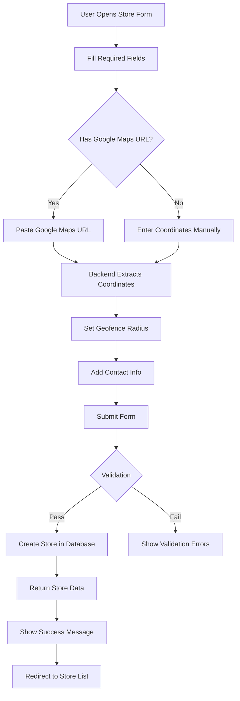

# 🏪 Store Creation - Frontend Developer Guide

**Version:** 1.0.0  
**Last Updated:** January 10, 2026  
**Backend API:** v2.0.0

---

## 📑 Table of Contents

1. [Quick Start](#quick-start)
2. [API Endpoint](#api-endpoint)
3. [Required Parameters](#required-parameters)
4. [Optional Parameters](#optional-parameters)
5. [Request Examples](#request-examples)
6. [Response Format](#response-format)
7. [Google Maps Integration](#google-maps-integration)
8. [Geofencing](#geofencing)
9. [Error Handling](#error-handling)
10. [Complete Flow](#complete-flow)
11. [Testing](#testing)

---

## Quick Start

**Endpoint:** `POST /api/hr/stores`  
**Auth Required:** Yes (HR, Admin, SuperAdmin)  
**Content-Type:** `application/json`

**Minimal Request:**
```json
{
  "name": "Store Name",
  "code": "STORE-CODE-001",
  "address": {
    "street": "123 Main Street",
    "city": "Mumbai",
    "country": "India"
  }
}
```

---

## API Endpoint

### Base URL
```
Production: https://98.70.245.87/api/hr/stores
Development: http://localhost:3002/api/hr/stores
```

### HTTP Method
```
POST
```

### Headers
```javascript
{
  "Authorization": "Bearer YOUR_ACCESS_TOKEN",
  "Content-Type": "application/json"
}
```

---

## Required Parameters

| Parameter | Type | Description | Example | Constraints |
|-----------|------|-------------|---------|-------------|
| `name` | string | Store display name | "Etelios Store - Mumbai Central" | Max 100 chars |
| `code` | string | Unique store identifier | "ETELIOS-MUM-001" | Uppercase, Max 50 chars, Unique |
| `address` | object | Store address details | See below | Required |
| `address.street` | string | Street address | "Shop No. 15, Nariman Point" | Required |
| `address.city` | string | City name | "Mumbai" | Required |
| `address.country` | string | Country name | "India" | Default: "India" |

---

## Optional Parameters

### Basic Information

| Parameter | Type | Description | Example | Default |
|-----------|------|-------------|---------|---------|
| `tenantId` | string | Multi-tenant ID | "tenant-xyz" | "default" |
| `description` | string | Store description | "Flagship store in Mumbai" | null |
| `store_type` | string | Store category | "retail", "warehouse", "office", "field", "other" | "retail" |
| `status` | string | Store operational status | "active", "inactive", "maintenance", "closed" | "active" |

### Address Details

| Parameter | Type | Description | Example | Default |
|-----------|------|-------------|---------|---------|
| `address.state` | string | State/Province | "Maharashtra" | null |
| `address.zipCode` | string | Postal/ZIP code | "400021" | null |

### Location & Geofencing

| Parameter | Type | Description | Example | Constraints |
|-----------|------|-------------|---------|-------------|
| `googleMapsUrl` | string | Google Maps link | "https://maps.google.com/?q=18.9250,72.8258" | Valid URI |
| `coordinates` | object | GPS coordinates | `{ latitude: 18.925, longitude: 72.8258 }` | Optional |
| `coordinates.latitude` | number | Latitude | 18.925 | -90 to 90 |
| `coordinates.longitude` | number | Longitude | 72.8258 | -180 to 180 |
| `geofenceRadius` | number | Geofence radius in meters | 150 | 10-1000, Default: 100 |

**Note:** If you provide `googleMapsUrl`, coordinates are **automatically extracted**. You don't need to manually send coordinates.

### Contact Information

| Parameter | Type | Description | Example | Format |
|-----------|------|-------------|---------|--------|
| `contact.phone` | string | Store phone number | "+91-9876543210" | Optional |
| `contact.email` | string | Store email | "mumbai@etelios.com" | Valid email |
| `phone` | string | Alternate phone field | "+91-9876543210" | Optional |
| `email` | string | Alternate email field | "mumbai@etelios.com" | Valid email |

**Note:** You can use either nested (`contact.phone`) or flat (`phone`) format. Both are supported.

### Management

| Parameter | Type | Description | Example |
|-----------|------|-------------|---------|
| `manager` | object | Store manager assignment | `{ employeeId: "EMP-MGR-001" }` |
| `manager.employeeId` | string | Employee ID of manager | "EMP-MGR-001" |

### Operating Hours

| Parameter | Type | Description | Example |
|-----------|------|-------------|---------|
| `operatingHours` | object | Weekly operating schedule | See example below |

**Operating Hours Format:**
```json
{
  "operatingHours": {
    "monday": { "open": "09:00", "close": "21:00" },
    "tuesday": { "open": "09:00", "close": "21:00" },
    "wednesday": { "open": "09:00", "close": "21:00" },
    "thursday": { "open": "09:00", "close": "21:00" },
    "friday": { "open": "09:00", "close": "21:00" },
    "saturday": { "open": "09:00", "close": "21:00" },
    "sunday": { "open": "10:00", "close": "20:00" }
  }
}
```

---

## Request Examples

### Example 1: Minimal Store Creation

**Use Case:** Quick store creation with only required fields

```javascript
const createMinimalStore = async (token) => {
  const response = await fetch('https://98.70.245.87/api/hr/stores', {
    method: 'POST',
    headers: {
      'Authorization': `Bearer ${token}`,
      'Content-Type': 'application/json'
    },
    body: JSON.stringify({
      name: "Quick Store",
      code: "QS-001",
      address: {
        street: "123 Main St",
        city: "Delhi",
        country: "India"
      }
    })
  });
  
  return await response.json();
};
```

**Expected Response:**
```json
{
  "success": true,
  "data": {
    "id": "store-uuid-123",
    "name": "Quick Store",
    "code": "QS-001",
    "address": {
      "street": "123 Main St",
      "city": "Delhi",
      "country": "India"
    },
    "status": "active",
    "geofenceRadius": 100,
    "createdAt": "2026-01-10T09:40:22.893Z"
  },
  "message": "Store created successfully"
}
```

---

### Example 2: Store with Google Maps URL (RECOMMENDED)

**Use Case:** Store creation with automatic coordinate extraction

```javascript
const createStoreWithGoogleMaps = async (token) => {
  const response = await fetch('https://98.70.245.87/api/hr/stores', {
    method: 'POST',
    headers: {
      'Authorization': `Bearer ${token}`,
      'Content-Type': 'application/json'
    },
    body: JSON.stringify({
      name: "Etelios Store - Mumbai Central",
      code: "ETELIOS-MUM-001",
      address: {
        street: "Shop No. 15, Nariman Point",
        city: "Mumbai",
        state: "Maharashtra",
        zipCode: "400021",
        country: "India"
      },
      contact: {
        phone: "+91-9876543210",
        email: "mumbai.central@etelios.com"
      },
      googleMapsUrl: "https://maps.google.com/?q=18.9250,72.8258",
      geofenceRadius: 150,
      store_type: "retail",
      status: "active"
    })
  });
  
  return await response.json();
};
```

**Backend Magic:** ✨
- Coordinates are **automatically extracted** from Google Maps URL
- No need to manually calculate latitude/longitude
- Supports 4+ Google Maps URL formats

**Expected Response:**
```json
{
  "success": true,
  "data": {
    "id": "69621e86c47e28ff49c5f731",
    "tenantId": "default",
    "name": "Etelios Store - Mumbai Central",
    "code": "ETELIOS-MUM-001",
    "address": {
      "street": "Shop No. 15, Nariman Point",
      "city": "Mumbai",
      "state": "Maharashtra",
      "zipCode": "400021",
      "country": "India"
    },
    "coordinates": {
      "latitude": 18.925,
      "longitude": 72.8258
    },
    "googleMapsUrl": "https://maps.google.com/?q=18.9250,72.8258",
    "geofenceRadius": 150,
    "contact": {
      "phone": "+91-9876543210",
      "email": "mumbai.central@etelios.com"
    },
    "phone": "+91-9876543210",
    "email": "mumbai.central@etelios.com",
    "store_type": "retail",
    "status": "active",
    "storeCode": "ETELIOS-MUM-001",
    "latitude": 18.925,
    "longitude": 72.8258,
    "street": "Shop No. 15, Nariman Point",
    "city": "Mumbai",
    "state": "Maharashtra",
    "pincode": "400021",
    "country": "India",
    "createdAt": "2026-01-10T09:40:22.893Z",
    "updatedAt": "2026-01-10T09:40:22.893Z"
  },
  "message": "Store created successfully"
}
```

---

### Example 3: Complete Store with All Features

**Use Case:** Full store setup with manager, hours, and all details

```javascript
const createCompleteStore = async (token) => {
  const response = await fetch('https://98.70.245.87/api/hr/stores', {
    method: 'POST',
    headers: {
      'Authorization': `Bearer ${token}`,
      'Content-Type': 'application/json'
    },
    body: JSON.stringify({
      tenantId: "tenant-001",
      name: "Etelios Store - Bangalore Koramangala",
      code: "ETELIOS-BLR-003",
      description: "Premium eyewear store in Koramangala tech hub",
      
      address: {
        street: "100 Feet Road, 5th Block",
        city: "Bangalore",
        state: "Karnataka",
        zipCode: "560034",
        country: "India"
      },
      
      googleMapsUrl: "https://maps.google.com/?q=12.9352,77.6245",
      geofenceRadius: 200,
      
      contact: {
        phone: "+91-9876543212",
        email: "bangalore.koramangala@etelios.com"
      },
      
      manager: {
        employeeId: "EMP-MGR-003"
      },
      
      operatingHours: {
        monday: { open: "09:00", close: "21:00" },
        tuesday: { open: "09:00", close: "21:00" },
        wednesday: { open: "09:00", close: "21:00" },
        thursday: { open: "09:00", close: "21:00" },
        friday: { open: "09:00", close: "21:00" },
        saturday: { open: "09:00", close: "21:00" },
        sunday: { open: "10:00", close: "20:00" }
      },
      
      store_type: "retail",
      status: "active"
    })
  });
  
  return await response.json();
};
```

---

### Example 4: React/Next.js Form Submission

```typescript
import { useState } from 'react';

interface StoreFormData {
  name: string;
  code: string;
  address: {
    street: string;
    city: string;
    state?: string;
    zipCode?: string;
    country: string;
  };
  googleMapsUrl?: string;
  phone?: string;
  email?: string;
  geofenceRadius?: number;
}

const StoreCreationForm = () => {
  const [formData, setFormData] = useState<StoreFormData>({
    name: '',
    code: '',
    address: {
      street: '',
      city: '',
      state: '',
      zipCode: '',
      country: 'India'
    },
    googleMapsUrl: '',
    phone: '',
    email: '',
    geofenceRadius: 150
  });

  const handleSubmit = async (e: React.FormEvent) => {
    e.preventDefault();
    
    try {
      const token = localStorage.getItem('accessToken');
      
      const response = await fetch('https://98.70.245.87/api/hr/stores', {
        method: 'POST',
        headers: {
          'Authorization': `Bearer ${token}`,
          'Content-Type': 'application/json'
        },
        body: JSON.stringify(formData)
      });
      
      const result = await response.json();
      
      if (result.success) {
        console.log('✅ Store created:', result.data);
        // Show success message, redirect, etc.
      } else {
        console.error('❌ Error:', result.message);
        // Show error message
      }
    } catch (error) {
      console.error('❌ Request failed:', error);
    }
  };

  return (
    <form onSubmit={handleSubmit}>
      {/* Form fields */}
    </form>
  );
};
```

---

## Response Format

### Success Response (201 Created)

```json
{
  "success": true,
  "data": {
    "id": "store-uuid",
    "tenantId": "default",
    "name": "Store Name",
    "code": "STORE-CODE",
    "storeCode": "STORE-CODE",
    
    "address": { ... },
    "street": "extracted",
    "city": "extracted",
    "state": "extracted",
    "pincode": "extracted",
    "country": "extracted",
    
    "coordinates": {
      "latitude": 18.925,
      "longitude": 72.8258
    },
    "latitude": 18.925,
    "longitude": 72.8258,
    
    "googleMapsUrl": "https://maps.google.com/?q=...",
    "geofenceRadius": 150,
    
    "contact": { ... },
    "phone": "extracted",
    "email": "extracted",
    
    "store_type": "retail",
    "status": "active",
    "is_active": true,
    "isDeleted": false,
    
    "createdBy": "user-id",
    "updatedBy": "user-id",
    "createdAt": "2026-01-10T09:40:22.893Z",
    "updatedAt": "2026-01-10T09:40:22.893Z"
  },
  "message": "Store created successfully"
}
```

### Response Fields Explanation

**Core Fields:**
- `id` / `_id`: Unique MongoDB identifier
- `storeCode`: Alias for `code` (for frontend compatibility)
- `latitude`, `longitude`: Direct access to coordinates (virtuals)
- `street`, `city`, `state`, `pincode`, `country`: Direct access to address components (virtuals)
- `phone`, `email`: Direct access to contact info (synced with nested `contact` object)

**Status Fields:**
- `status`: Operational status (active, inactive, maintenance, closed)
- `is_active`: Boolean active flag
- `isDeleted`: Soft delete flag (always false for new stores)

---

## Google Maps Integration

### Supported URL Formats

The backend automatically extracts coordinates from these Google Maps URL formats:

1. **Query Parameter Format:**
   ```
   https://maps.google.com/?q=18.9250,72.8258
   ```

2. **Standard Format with Zoom:**
   ```
   https://www.google.com/maps/@18.9250,72.8258,15z
   ```

3. **Place Format:**
   ```
   https://www.google.com/maps/place/.../@18.9250,72.8258,17z
   ```

4. **LL Parameter:**
   ```
   https://maps.google.com/?ll=18.9250,72.8258
   ```

### How to Get Google Maps URL

**Option 1: Desktop**
1. Open Google Maps
2. Right-click on the store location
3. Click "What's here?"
4. Copy the coordinates or URL from the address bar

**Option 2: Mobile**
1. Open Google Maps app
2. Long-press on the store location
3. Tap on the coordinates at the bottom
4. Share → Copy link

**Option 3: Generate from Address**
1. Search for the address in Google Maps
2. Click "Share"
3. Copy link

### Frontend Helper Function

```typescript
/**
 * Extract coordinates from Google Maps URL
 * (Optional: Do this client-side for immediate feedback)
 */
function extractCoordinatesFromGoogleMapsUrl(url: string): {
  latitude: number;
  longitude: number;
} | null {
  if (!url) return null;

  // Pattern 1: ?q=lat,lng
  const pattern1 = /[?&]q=(-?\d+\.?\d*),(-?\d+\.?\d*)/;
  const match1 = url.match(pattern1);
  if (match1) {
    return {
      latitude: parseFloat(match1[1]),
      longitude: parseFloat(match1[2])
    };
  }

  // Pattern 2: @lat,lng,zoom
  const pattern2 = /@(-?\d+\.?\d*),(-?\d+\.?\d*),\d+z/;
  const match2 = url.match(pattern2);
  if (match2) {
    return {
      latitude: parseFloat(match2[1]),
      longitude: parseFloat(match2[2])
    };
  }

  // Pattern 3: @lat,lng (without zoom)
  const pattern3 = /@(-?\d+\.?\d*),(-?\d+\.?\d*)/;
  const match3 = url.match(pattern3);
  if (match3) {
    return {
      latitude: parseFloat(match3[1]),
      longitude: parseFloat(match3[2])
    };
  }

  return null;
}

// Usage in form:
const handleGoogleMapsUrlChange = (url: string) => {
  setFormData(prev => ({ ...prev, googleMapsUrl: url }));
  
  // Extract and show coordinates (optional)
  const coords = extractCoordinatesFromGoogleMapsUrl(url);
  if (coords) {
    console.log('Coordinates extracted:', coords);
    // Optionally pre-fill coordinate fields for user verification
  }
};
```

---

## Geofencing

### What is Geofencing?

Geofencing creates a virtual boundary around the store location. Employees can only clock in/out when they are within this boundary.

### Geofence Radius

- **Default:** 100 meters
- **Minimum:** 10 meters
- **Maximum:** 1000 meters (1 km)
- **Recommended:** 
  - Small stores: 50-100 meters
  - Large stores/warehouses: 150-300 meters
  - Campus/complex: 300-500 meters

### How It Works

1. Employee opens attendance app
2. App gets current GPS location
3. Backend calculates distance to store
4. If within geofence radius → ✅ Allow clock-in
5. If outside geofence radius → ❌ Deny clock-in with distance message

### Testing Geofence

After creating a store, you can test geofencing:

```javascript
const testGeofence = async (storeId, token) => {
  const response = await fetch(
    `https://98.70.245.87/api/hr/stores/${storeId}/verify-geofence`,
    {
      method: 'POST',
      headers: {
        'Authorization': `Bearer ${token}`,
        'Content-Type': 'application/json'
      },
      body: JSON.stringify({
        latitude: 18.9255,  // Employee's current location
        longitude: 72.8260
      })
    }
  );
  
  return await response.json();
};

// Response:
{
  "success": true,
  "data": {
    "withinGeofence": true,
    "distance": 45.5,
    "distanceUnit": "meters",
    "geofenceRadius": 150,
    "excess": 0,
    "checkedAt": "2026-01-10T10:00:00Z"
  },
  "message": "Location verified. You are within the store geofence."
}
```

---

## Error Handling

### Common Errors

#### 1. Validation Error (400)

**Cause:** Missing required fields or invalid data

```json
{
  "success": false,
  "error": "Validation failed",
  "message": "Missing required fields: name and code are required",
  "details": {
    "missingFields": ["name", "code"]
  }
}
```

**Fix:** Ensure all required fields are provided

#### 2. Duplicate Store Code (409)

**Cause:** Store code already exists

```json
{
  "success": false,
  "error": "Store already exists",
  "message": "A store with code 'ETELIOS-MUM-001' already exists"
}
```

**Fix:** Use a unique store code

#### 3. Invalid Coordinates (400)

**Cause:** Latitude/longitude out of valid range

```json
{
  "success": false,
  "error": "Invalid coordinates",
  "message": "Latitude must be between -90 and 90, longitude between -180 and 180"
}
```

**Fix:** Verify coordinates are valid GPS values

#### 4. Authentication Required (401)

**Cause:** Missing or invalid access token

```json
{
  "success": false,
  "error": "Authentication required",
  "message": "No authentication token provided"
}
```

**Fix:** Include valid Bearer token in Authorization header

#### 5. Insufficient Permissions (403)

**Cause:** User role doesn't have permission to create stores

```json
{
  "success": false,
  "error": "Access denied",
  "message": "Insufficient permissions to create stores"
}
```

**Fix:** User must have HR, Admin, or SuperAdmin role

### Error Handling Example

```typescript
const createStoreWithErrorHandling = async (formData: StoreFormData) => {
  try {
    const token = localStorage.getItem('accessToken');
    
    if (!token) {
      throw new Error('Please login first');
    }

    const response = await fetch('https://98.70.245.87/api/hr/stores', {
      method: 'POST',
      headers: {
        'Authorization': `Bearer ${token}`,
        'Content-Type': 'application/json'
      },
      body: JSON.stringify(formData)
    });

    const result = await response.json();

    if (!response.ok) {
      // Handle HTTP errors
      switch (response.status) {
        case 400:
          throw new Error(result.message || 'Invalid data provided');
        case 401:
          throw new Error('Session expired. Please login again');
        case 403:
          throw new Error('You do not have permission to create stores');
        case 409:
          throw new Error('Store code already exists. Please use a unique code');
        default:
          throw new Error(result.message || 'Failed to create store');
      }
    }

    if (!result.success) {
      throw new Error(result.message || 'Failed to create store');
    }

    return {
      success: true,
      data: result.data,
      message: result.message
    };

  } catch (error) {
    console.error('Store creation error:', error);
    return {
      success: false,
      error: error.message
    };
  }
};
```

---

## Complete Flow

### Step-by-Step Store Creation Flow



### Implementation Checklist

- [ ] Create store form with all required fields
- [ ] Add Google Maps URL input field
- [ ] Implement Google Maps URL validation (optional)
- [ ] Add geofence radius slider (10-1000m)
- [ ] Include contact information fields
- [ ] Add operating hours configuration
- [ ] Implement form validation
- [ ] Add error handling for all error codes
- [ ] Show success message on creation
- [ ] Redirect to store list or store details page
- [ ] Add loading state during API call
- [ ] Implement retry logic for network errors

---

## Testing

### Test Cases

#### Test Case 1: Minimal Store

```javascript
POST /api/hr/stores

{
  "name": "Test Store Minimal",
  "code": "TEST-MIN-001",
  "address": {
    "street": "Test Street",
    "city": "Test City",
    "country": "India"
  }
}

✅ Expected: 201 Created
✅ Store created with default geofenceRadius=100
```

#### Test Case 2: Store with Google Maps

```javascript
POST /api/hr/stores

{
  "name": "Test Store with Maps",
  "code": "TEST-MAPS-001",
  "address": {
    "street": "Test Street",
    "city": "Mumbai",
    "state": "Maharashtra",
    "zipCode": "400001",
    "country": "India"
  },
  "googleMapsUrl": "https://maps.google.com/?q=19.0760,72.8777",
  "geofenceRadius": 200
}

✅ Expected: 201 Created
✅ Coordinates extracted: { latitude: 19.076, longitude: 72.8777 }
✅ Geofence radius: 200m
```

#### Test Case 3: Duplicate Code

```javascript
POST /api/hr/stores

{
  "name": "Duplicate Test",
  "code": "ETELIOS-MUM-001",  // Already exists
  "address": { ... }
}

❌ Expected: 409 Conflict
❌ Error: "A store with code 'ETELIOS-MUM-001' already exists"
```

#### Test Case 4: Missing Required Field

```javascript
POST /api/hr/stores

{
  "name": "Missing Code",
  // "code" is missing
  "address": { ... }
}

❌ Expected: 400 Bad Request
❌ Error: "Missing required fields: code"
```

#### Test Case 5: Invalid Coordinates

```javascript
POST /api/hr/stores

{
  "name": "Invalid Coords",
  "code": "TEST-INVALID-001",
  "address": { ... },
  "coordinates": {
    "latitude": 999,  // Invalid (> 90)
    "longitude": 72.8258
  }
}

❌ Expected: 400 Bad Request
❌ Error: "Latitude must be between -90 and 90"
```

### Postman/Thunder Client Collection

```json
{
  "name": "Store Management",
  "requests": [
    {
      "name": "Create Store",
      "method": "POST",
      "url": "{{baseUrl}}/api/hr/stores",
      "headers": {
        "Authorization": "Bearer {{accessToken}}",
        "Content-Type": "application/json"
      },
      "body": {
        "name": "{{$randomCompanyName}} Store",
        "code": "STORE-{{$timestamp}}",
        "address": {
          "street": "{{$randomStreetAddress}}",
          "city": "{{$randomCity}}",
          "state": "Maharashtra",
          "zipCode": "400001",
          "country": "India"
        },
        "googleMapsUrl": "https://maps.google.com/?q=19.0760,72.8777",
        "geofenceRadius": 150,
        "contact": {
          "phone": "+91-9876543210",
          "email": "{{$randomEmail}}"
        }
      }
    }
  ]
}
```

---

## Quick Reference

### Required Fields Summary
```
✅ name
✅ code (unique, uppercase)
✅ address.street
✅ address.city
✅ address.country (default: India)
```

### Recommended Fields
```
🌟 googleMapsUrl (for automatic coordinates)
🌟 geofenceRadius (for attendance)
🌟 contact.phone
🌟 contact.email
🌟 address.state
🌟 address.zipCode
```

### Optional Enhancement Fields
```
⭐ manager.employeeId
⭐ operatingHours
⭐ description
⭐ store_type
```

---

## Support & Questions

**Backend API Issues:**
- Check API response for detailed error messages
- Verify authentication token is valid
- Ensure user has required permissions (HR/Admin/SuperAdmin)

**Frontend Issues:**
- Validate form data before submission
- Handle all error codes (400, 401, 403, 409)
- Implement loading states
- Show user-friendly error messages

**Need Help?**
- Contact: backend-team@etelios.com
- Slack: #hrms-dev-support
- Documentation: https://docs.etelios.com/hrms/stores

---

**Version History:**
- v1.0.0 (Jan 10, 2026) - Initial release with Google Maps integration

**Last Updated:** January 10, 2026

