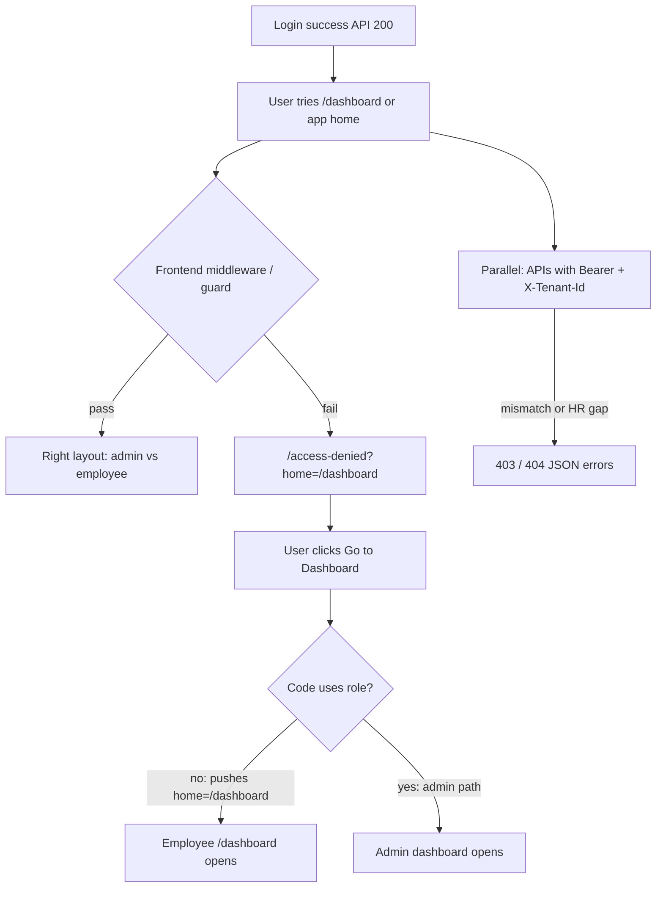

# Bug story: Admin login OK, “Access Denied”, phir Employee Dashboard — poora explain (Hinglish)

**Kis liye:** Upcapto (ya koi bhi tenant) par **admin** login karne ke baad jo confusion / galat UX aa raha hai — ek hi document mein **user kya dekhta hai**, **actually kya ho raha hai**, aur **fix kis layer par hai**.  
**Last updated:** April 2026

---

## 1. TL;DR (30 second)

- Login **success** = sirf auth theek hai. **Dashboard / JTS / HR** alag checks.
- Jo **“Access Denied”** page dikhta hai, aksar **Next.js ka apna route** hai (`/access-denied`) — iska matlab hamesha “API ne 403 mara” nahi.
- **“Go to Dashboard”** button galat jagah bhej raha hai: **`/dashboard` = employee shell** treat ho raha hai, **role se admin route nahi chuna ja raha**.
- Alag se **tenant header** (`X-Tenant-Id: upcapto`) galat ho to **JTS** etc. par **403** aata hai — admin hone se bach nahi pata.

Neeche poora flow step-by-step.

---

## 2. User ko kya dikhta hai (real sequence)

1. **Login** karte ho — lagta hai sab theek (password accept, app andar aa gaye).
2. Kuch karte hi ya **dashboard** open karte hi ek page: **“Access Denied”** — red shield, message: permission nahi, admin se contact karo, wagaira.
3. URL kuch aisa: **`/access-denied?home=%2Fdashboard`** (matlab `home=/dashboard`).
4. **“Go to Dashboard”** dabate ho — **employee wala dashboard** khul jata hai (admin wala nahi).

Yeh teen cheezein **ek saath** confusing lagti hain: *“Main admin hoon, phir deny kyun, phir dashboard khol diya lekin employee jaisa?”*

---

## 3. Yeh ek single bug nahi — teen layer mix hain

### Layer A: Frontend “Access Denied” page (UI route)

- Yeh page **HTTP 403 ki copy-paste error** nahi hai.
- Browser **Network** mein is document ka status **200** bhi ho sakta hai — normal HTML page load.
- Matlab: **middleware / route guard** ne decide kiya: *“Is user ko yeh screen (`/dashboard` ya jo bhi target tha) nahi dikhani.”*  
  Redirect karke **`/access-denied`** par la diya, aur query mein **`home=/dashboard`** rakh diya taaki wapas jaane ka “intent” save ho.

**Common reasons guard fail kare (admin par bhi):**

- **`localStorage` / cookie** mein **`tenantId` galat** ya purana (dusre tenant ka).
- Token **purana** ya **cookie vs Authorization** mix — ek jagah admin, ek jagah purana user.
- Guard ne **sirf `permissions` array** dekhi — koi **specific key** (jaise `view_dashboard`) chahiye thi, JWT mein spelling / list mismatch.
- **Service Worker (`sw.js`)** ne purana shell / cache serve kiya — initiator mein `staleWhileRevalidate` dikhe to **unregister + hard refresh** try karna worth hai.

**Important:** Is layer par **“admin = sab kuch”** automatically apply nahi hota — **jo code likha hai wahi chalega**. Agar code ne `/dashboard` ko “employee zone” maana hai aur admin ke liye alag path `/admin/...` hai, to bina role check ke **deny + galat recovery** dono ho sakte hain.

---

### Layer B: “Go to Dashboard” → Employee dashboard (clear UX / routing bug)

Yeh almost certainly **routing bug** hai, backend “admin ko employee banane” wala nahi.

- Query **`home=/dashboard`** seedha **generic dashboard route** hai.
- Bahut apps mein **`/dashboard` = default employee home** hota hai.
- Button shayad **`router.push(home || '/dashboard')`** jaisa kuch karta hai — **`role` (admin / hr / superadmin) use nahi ho raha**.

**Expected behaviour:**

- **`admin` / `hr` / `superadmin`** → jo bhi **admin dashboard** ka real path hai (project ke hisaab se).
- **`employee`** → `/dashboard` (ya jo employee home ho).

**Isliye:** Pehle **Access Denied** (guard strict / confused), phir button **employee route** khol deta hai — user ko lagta hai system “ulta” chal raha hai; actually **destination hardcoded / generic** hai.

---

### Layer C: Backend / API (tenant, JTS, HR row)

Yahan **admin identity** hone se bhi **403 / 404** aa sakte hain — alag reasons se.

| Problem | Kya hota hai |
|--------|----------------|
| **`X-Tenant-Id` JWT se match nahi** | Kuch services (khaaskar **JTS**) **`JTS_TENANT_HEADER_MISMATCH`** (403) dete hain. |
| **HR mein admin email ka employee row nahi** | **`bind-from-jwt`** type flows **`EMPLOYEE_001_NOT_FOUND`** — JTS / actor link tuta rehta hai. |
| **Tenant isolation** | Dusre tenant ka data — admin ho, **apne tenant** ke bahar allow nahi. |

Yeh **Layer A** se independent bhi ho sakta hai: UI pehle deny dikha de, ya baad mein API red ho.

---

## 4. Flow diagram (mental model)

---

## 5. “Admin ko to full access hona chahiye na?” — expectation vs system

- **Human meaning:** “Admin = company ka malik jaisa sab dekh le.”
- **System meaning:** Har **microservice** aur **frontend route** apna check karta hai: **role**, **permissions array**, **tenant**, **resource**.  
  **`admin` ≠ har jagah `superadmin`**; kuch cheezein sirf **superadmin** ko khuli hoti hain.
- **JWT** mein **permissions** list hoti hai — agar UI ne **ek random permission string** hardcode kar rakhi hai jo list mein nahi, guard fail ho sakta hai **chahe role admin ho**.

Isliye **deny** ka matlab hamesha “account fake admin hai” nahi — aksar **guard rule galat / strict / tenant galat** hai.

---

## 6. Debug checklist (order mein)

1. **Network → All** (sirf XHR mat): `/access-denied` se pehle **koi redirect** ya **403 API** hai ya nahi dekho.
2. **Failing API** ka **poora JSON** (`error` / `code`) save karo.
3. **`localStorage`:** `tenantId` === JWT wala tenant (**`upcapto`**)?
4. **JWT decode:** `role`, `tenantId`, `permissions` — screenshot / list.
5. **Service Worker** unregister → hard reload.
6. **Frontend code:**  
   - `/access-denied` kahan **redirect** karta hai?  
   - **“Go to Dashboard”** kya **`router.push`** kar raha hai — **`role` branch** hai ya nahi?

---

## 7. Fix ownership (kis team ko kya)

| Issue | Kis side |
|--------|-----------|
| Access denied page pe **galat guard** (tenant / permission string) | **Frontend** + optional **auth contract** align |
| **Go to Dashboard** → employee route | **Frontend** — **role-based default path** |
| **`JTS_TENANT_HEADER_MISMATCH`** | **Frontend / client** — header JWT ke saath; **docs** already hain |
| **`EMPLOYEE_001_NOT_FOUND`** (admin HR row missing) | **Data / backend ops** — HR employee create + phir JTS bind |
| **SW cache weird** | **Frontend** — SW strategy / unregister instructions |

---

## 8. Related docs (repo)

- `docs/UPCAPTO_ACCESS_DENIED_RBAC_HINGLISH_MASTER_APRIL_2026.md` — combined reference (login, RBAC, headers).
- `docs/UPCAPTO_LOGIN_ACCESS_DENIED_TROUBLESHOOTING.md` — API 403 codes.
- `docs/UPCAPTO_ADMIN_LOGIN_PROD_ERRORS_APRIL_2026.md` — HR row + JTS bind.

---

*Yeh document sirf explain + triage ke liye hai; exact route names (`/admin/...`) tumhare Next.js app ke folder structure se confirm karne honge — is monorepo mein woh UI har baar present nahi hota.*
