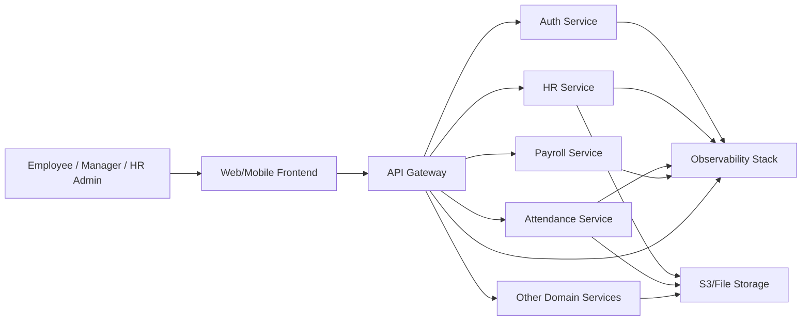
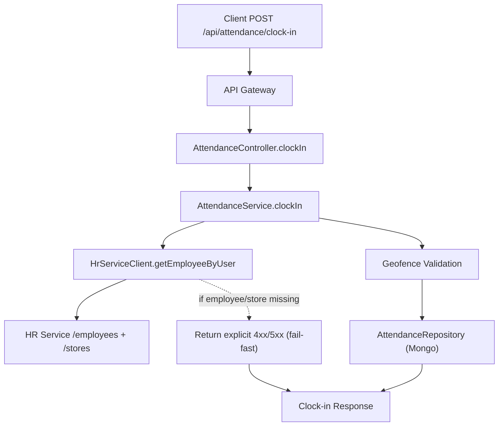

# Lenstrack Smart HRMS - C4 Architecture

## Scope
This document defines the target C4 model for the current codebase and deployment model (API gateway + microservices on Kubernetes).

## Level 1 - System Context (C1)
### Purpose
Lenstrack Smart HRMS provides HR, attendance, payroll, and related enterprise workflows for multi-tenant organizations.

### External Actors and Systems
- Employee, Manager, HR Admin, Super Admin
- Web/Mobile Frontend
- File Storage (S3-compatible)
- Observability Stack (logs/metrics/traces)
- Identity/JWT clients

### Context Flowchart

## Level 2 - Container View (C2)
### Containers
- API Gateway (Node.js): entrypoint, routing, auth propagation, rate limiting, timeout/circuit policies.
- Domain Microservices (Node.js): auth, hr, attendance, payroll, crm, inventory, sales, purchase, financial, document, monitoring, analytics, etc.
- Per-service Database (MongoDB/DocumentDB): each service owns its data.
- Redis: cache, rate limiting, ephemeral coordination.
- Storage Service: binary uploads and attachments.

### Key Rules
- Database-per-service, no direct cross-service DB access.
- Tenant context required on every request (`tenantId` from JWT + headers).
- Synchronous calls only for immediate business checks; async/event flows for side effects.
- Strict bounded timeouts and fail-fast behavior at gateway and service clients.

## Level 3 - Component View (C3) - Attendance Flow
### Main Components (Attendance Service)
- `AttendanceController`: HTTP handlers for clock-in/clock-out/status.
- `AttendanceService`: core business logic (lookup, geofence, state transitions).
- `HrServiceClient`: employee/store lookup in HR service.
- `AttendanceRepository` (models): persistence and query patterns.
- `Audit/Logger`: compliance and traceability.

### Clock-In Component Flow

## Non-Functional Architecture Requirements
- Latency budgets:
  - Gateway upstream timeout: 8-12s
  - Inter-service request timeout: 1.5-3s
  - Total request budget per endpoint must be bounded.
- Availability:
  - Health/readiness probes per service.
  - Circuit breaker and retry (idempotent requests only).
- Security:
  - JWT verification at edge and service.
  - Tenant isolation by policy.
  - Secret management through K8s secrets + cloud secret manager.
- Observability:
  - Correlation ID propagation.
  - Structured logs with `tenantId`, `userId`, `requestId`.
  - Metrics for timeout rate, dependency failures, P95/P99 latency.

## Architecture Decisions (Current to Target)
- Keep API gateway as the single ingress.
- Keep microservice boundaries by business domain.
- Remove long fallback loops in critical synchronous paths.
- Introduce explicit error contracts for missing HR master data.
- Add event-driven integration for downstream effects (payroll/notifications) where synchronous coupling is not required.

## Risks and Mitigations
- Tenant mismatch across services:
  - Mitigation: strict tenant claim validation + shared middleware contract.
- Missing HR master data causing attendance failures:
  - Mitigation: preflight data checks + deterministic error responses + admin repair workflow.
- Timeout amplification across chained calls:
  - Mitigation: global request budget and bounded retries.

## Next C4 Extensions
- C3 docs for Auth, HR, Payroll containers.
- C4 dynamic diagrams for clock-out, onboarding, payroll generation.
- Deployment view (Kubernetes namespaces, ingress, config/secrets, autoscaling).
