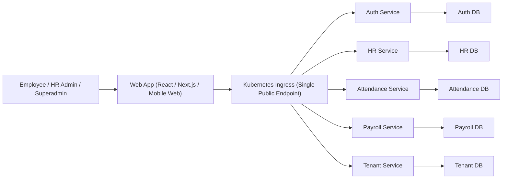
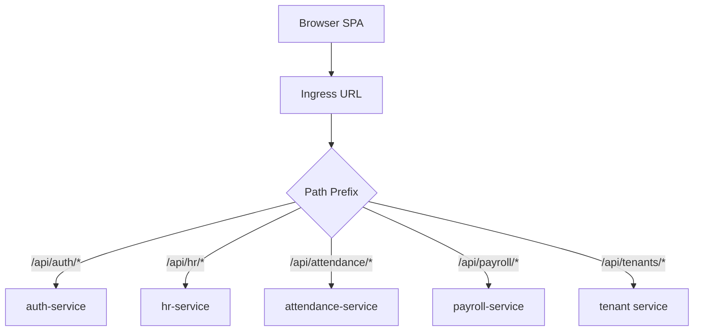
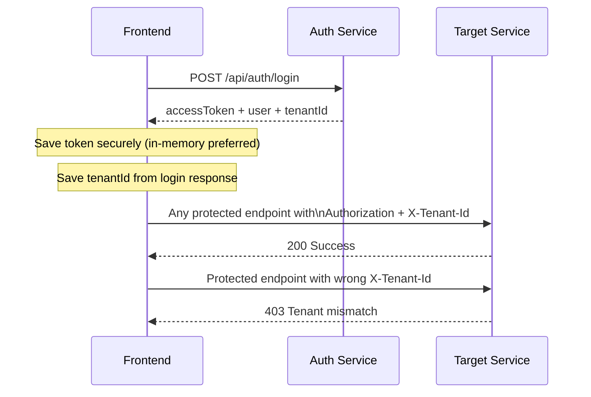
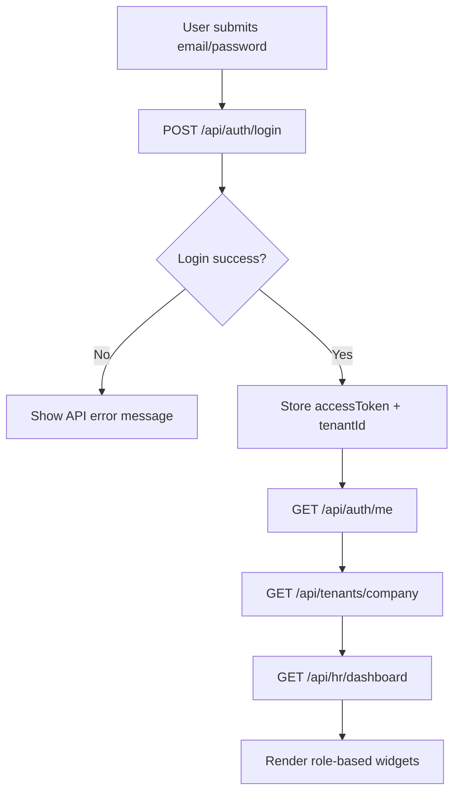
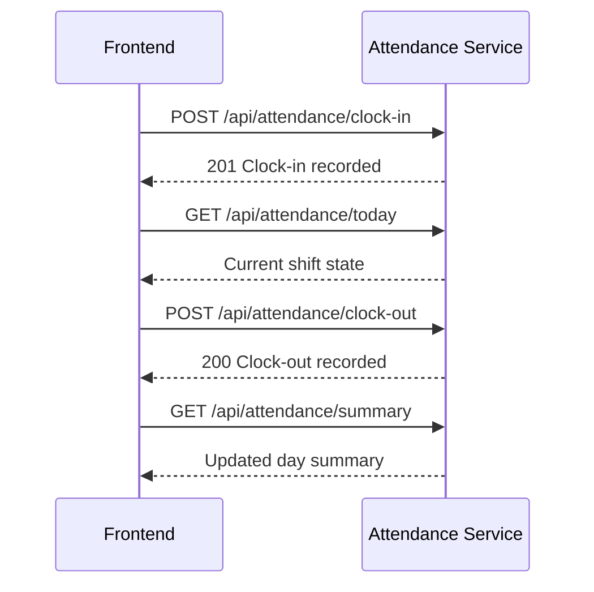
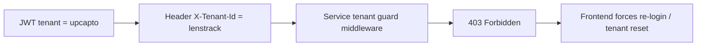
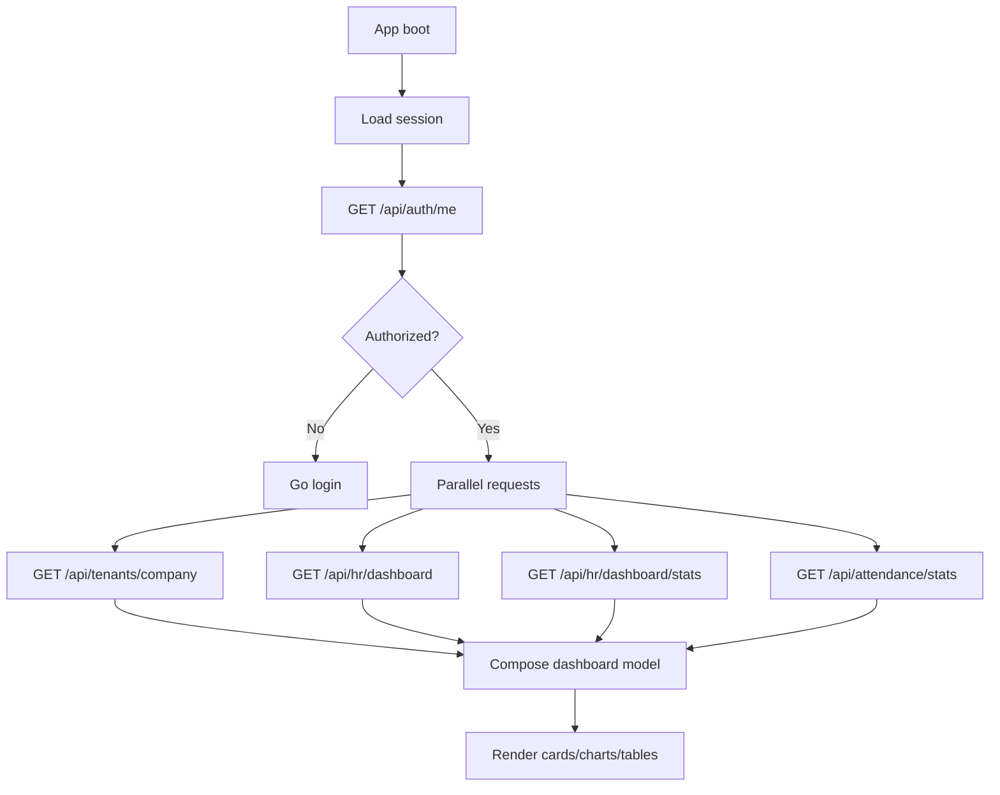

# Frontend Developer Realtime Integration Guide

## 1. Purpose

This document is the single frontend integration reference for the current production backend.
It is based on realtime API validation done on **2026-02-25**.

## 2. Current Production Topology

Important: this setup is **Ingress based**. There is **no separate API Gateway service** in the request path.

- Frontend calls one ingress base URL.
- Ingress routes by path prefix to microservices.
- Services validate JWT and tenant isolation internally.

### 2.1 C4 Context (Frontend View)



### 2.2 C4 Container (Request Routing)



## 3. Realtime Test Status (2026-02-25)

Full regression rerun completed with production ingress.

- Total APIs tested: **41**
- Pass: **41**
- Fail: **0**
- Result marker: `RETEST_SUMMARY|pass=41|fail=0|total=41|date=2026-02-25`

High-signal checks that passed:

- Auth login/me/health
- HR employees/departments/stores/dashboard/stats
- Attendance today/summary/list/clock-in/clock-out/stats/store/department
- Roster weekly and weekly-enhanced
- Tenant guard check (`403` when header tenant mismatches token tenant)

## 4. Base URL and Environment Setup

## 4.1 Production Base URL

```bash
http://k8s-eteliosp-eteliosi-f5ad4f50f3-636936140.ap-south-1.elb.amazonaws.com
```

Use this as `API_BASE_URL` in frontend env.

## 4.2 Where to paste env values

### Next.js (`.env.local`)

```bash
NEXT_PUBLIC_API_BASE_URL=http://k8s-eteliosp-eteliosi-f5ad4f50f3-636936140.ap-south-1.elb.amazonaws.com
NEXT_PUBLIC_DEFAULT_TENANT=upcapto
NEXT_PUBLIC_REQUEST_TIMEOUT_MS=15000
```

### Vite (`.env`)

```bash
VITE_API_BASE_URL=http://k8s-eteliosp-eteliosi-f5ad4f50f3-636936140.ap-south-1.elb.amazonaws.com
VITE_DEFAULT_TENANT=upcapto
VITE_REQUEST_TIMEOUT_MS=15000
```

### CRA (`.env`)

```bash
REACT_APP_API_BASE_URL=http://k8s-eteliosp-eteliosi-f5ad4f50f3-636936140.ap-south-1.elb.amazonaws.com
REACT_APP_DEFAULT_TENANT=upcapto
REACT_APP_REQUEST_TIMEOUT_MS=15000
```

## 5. Authentication and Tenant Isolation (Mandatory)

Every authenticated request must include:

- `Authorization: Bearer <token>`
- `X-Tenant-Id: <tenantId>`

If `X-Tenant-Id` does not match token tenant, request is rejected.

### 5.1 Auth + Tenant Sequence



## 6. Frontend Request Contract

## 6.1 Standard Headers

```http
Content-Type: application/json
Authorization: Bearer <JWT>
X-Tenant-Id: <tenant-id>
```

For file upload endpoints, remove `Content-Type` and let browser set multipart boundary.

## 6.2 API Client (TypeScript)

```ts
const API_BASE_URL =
  process.env.NEXT_PUBLIC_API_BASE_URL ||
  process.env.VITE_API_BASE_URL ||
  process.env.REACT_APP_API_BASE_URL || '';

export type Session = {
  accessToken: string;
  tenantId: string;
};

export async function apiRequest<T>(
  path: string,
  options: RequestInit = {},
  session?: Session
): Promise<T> {
  const headers = new Headers(options.headers || {});

  if (!headers.has('Content-Type') && !(options.body instanceof FormData)) {
    headers.set('Content-Type', 'application/json');
  }

  if (session?.accessToken) {
    headers.set('Authorization', `Bearer ${session.accessToken}`);
  }

  if (session?.tenantId) {
    headers.set('X-Tenant-Id', session.tenantId);
  }

  const controller = new AbortController();
  const timeoutMs = Number(
    process.env.NEXT_PUBLIC_REQUEST_TIMEOUT_MS ||
      process.env.VITE_REQUEST_TIMEOUT_MS ||
      process.env.REACT_APP_REQUEST_TIMEOUT_MS ||
      15000
  );
  const timeout = setTimeout(() => controller.abort(), timeoutMs);

  try {
    const res = await fetch(`${API_BASE_URL}${path}`, {
      ...options,
      headers,
      signal: controller.signal,
      credentials: 'include'
    });

    const json = await res.json().catch(() => ({}));

    if (!res.ok) {
      throw new Error(
        json?.message || json?.error || `HTTP ${res.status} ${res.statusText}`
      );
    }

    return json as T;
  } finally {
    clearTimeout(timeout);
  }
}
```

## 7. Core User Flows

## 7.1 Login to Dashboard Data



## 7.2 Clock In / Clock Out



## 7.3 Tenant Guard (Security Flow)



## 8. Endpoint Map for Frontend

Use these for first-class UI features.

### 8.1 Auth

- `POST /api/auth/login`
- `GET /api/auth/me`
- `GET /api/auth/health`

### 8.2 Tenant

- `GET /api/tenants/company`

### 8.3 HR

- `GET /api/hr/employees`
- `GET /api/hr/departments`
- `GET /api/hr/stores`
- `GET /api/hr/dashboard`
- `GET /api/hr/dashboard/stats`
- `GET /api/hr/roster/weekly`
- `GET /api/hr/roster/weekly-enhanced`

### 8.4 Attendance

- `GET /api/attendance/today`
- `GET /api/attendance`
- `GET /api/attendance/summary`
- `GET /api/attendance/stats`
- `GET /api/attendance/store/:storeId`
- `GET /api/attendance/department/:departmentId`
- `POST /api/attendance/clock-in`
- `POST /api/attendance/clock-out`

### 8.5 Payroll

- `GET /api/payroll/health`
- `GET /api/payroll/status`

## 9. Role and UI Access Model

Render UI by role and actual API permission result.

### 9.1 Recommended strategy

- Always call `GET /api/auth/me` after login.
- Build `session.user.role`, `session.permissions`, `session.tenantId` store.
- Hide privileged actions in UI for non-authorized roles.
- Still handle backend `403` safely.

### 9.2 Practical role split

- Employee: own profile, own attendance/today, own clock-in/out.
- HR/Admin: employee list, department/stores, dashboards, attendance analytics.
- Superadmin: tenant-level operations and cross-tenant control screens.

## 10. Error Handling Playbook

## 10.1 API Error Matrix

| HTTP | Meaning | Frontend Action |
|---|---|---|
| 400 | Validation/business rule failure | Show server message; keep form state |
| 401 | Token missing/expired | Clear session; route to login |
| 403 | Role or tenant mismatch | Show no-access UI; avoid retry storm |
| 404 | Endpoint/data not found | Empty state with refresh option |
| 409 | Conflict (duplicate etc.) | Show conflict hint and editable fields |
| 422 | Unprocessable input | Highlight invalid fields |
| 429 | Rate limit | Backoff and retry with delay |
| 500 | Internal error | Error boundary + retry control |
| 502/503/504 | Upstream temporary issue | Exponential retry + user toast |

## 10.2 Retry Policy

- Do not retry `400/401/403/404` automatically.
- Retry only network errors and `5xx`.
- Max retry attempts: `2`.
- Backoff: `500ms`, then `1500ms`.

## 11. Clock-In/Clock-Out UI Contract

## 11.1 Client-Side Guard Conditions

Before clock-in call:

- Validate geolocation permission if location required in UI.
- Ensure user already loaded from `/api/auth/me`.
- Ensure tenant header exists.

Before clock-out call:

- Validate active shift exists (using `/api/attendance/today`).

## 11.2 UX states

- `Idle`
- `Clocking In...`
- `Working`
- `Clocking Out...`
- `Completed`
- `Error`

Use disabled buttons during in-flight requests to prevent duplicate submissions.

## 12. Dashboard Data Integration

## 12.1 Recommended load order

1. `/api/auth/me`
2. `/api/tenants/company`
3. `/api/hr/dashboard`
4. `/api/hr/dashboard/stats`
5. `/api/attendance/stats`

### 12.2 Dashboard Load Flow



## 13. Realtime Data Sanity Checks for Frontend QA

Before releasing frontend build:

- Login with at least 2 users from same tenant.
- Verify both can call `/api/auth/me` and `/api/tenants/company`.
- Verify employee cannot see another tenant data.
- Verify `X-Tenant-Id` mismatch returns `403`.
- Verify clock-in then clock-out success for both test users.
- Verify `/api/hr/stores` returns at least one store for active tenant.
- Verify roster weekly endpoints return `200`.

## 14. Copy-Paste cURL for Frontend Debug

Set env first:

```bash
export BASE_URL="http://k8s-eteliosp-eteliosi-f5ad4f50f3-636936140.ap-south-1.elb.amazonaws.com"
export TOKEN="<paste_jwt_here>"
export TENANT_ID="upcapto"
```

### 14.1 Who am I

```bash
curl -s "$BASE_URL/api/auth/me" \
  -H "Authorization: Bearer $TOKEN" \
  -H "X-Tenant-Id: $TENANT_ID"
```

### 14.2 Dashboard

```bash
curl -s "$BASE_URL/api/hr/dashboard" \
  -H "Authorization: Bearer $TOKEN" \
  -H "X-Tenant-Id: $TENANT_ID"
```

### 14.3 Attendance today

```bash
curl -s "$BASE_URL/api/attendance/today" \
  -H "Authorization: Bearer $TOKEN" \
  -H "X-Tenant-Id: $TENANT_ID"
```

### 14.4 Clock in

```bash
curl -s -X POST "$BASE_URL/api/attendance/clock-in" \
  -H "Authorization: Bearer $TOKEN" \
  -H "X-Tenant-Id: $TENANT_ID" \
  -H "Content-Type: application/json" \
  -d '{"location":{"latitude":26.85,"longitude":80.95}}'
```

### 14.5 Clock out

```bash
curl -s -X POST "$BASE_URL/api/attendance/clock-out" \
  -H "Authorization: Bearer $TOKEN" \
  -H "X-Tenant-Id: $TENANT_ID" \
  -H "Content-Type: application/json" \
  -d '{"location":{"latitude":26.85,"longitude":80.95}}'
```

## 15. Frontend Folder Structure (Recommended)

```text
src/
  api/
    client.ts
    auth.api.ts
    hr.api.ts
    attendance.api.ts
    payroll.api.ts
    tenants.api.ts
  features/
    auth/
    dashboard/
    attendance/
    hr/
  stores/
    session.store.ts
    tenant.store.ts
  hooks/
    useSession.ts
    useTenantGuard.ts
    useAttendanceActions.ts
  pages/ or app/
```

## 16. Production Readiness Checklist

- API base URL configured from env only.
- Token refresh or forced logout flow implemented.
- Tenant header injected in every protected request.
- Centralized API client and error mapper in place.
- Request timeout and cancellation enabled.
- Role-based route guards implemented.
- 401 and 403 global handlers implemented.
- Attendance duplicate-click prevention in UI.
- Empty states and retry actions available on dashboards.

## 17. Known Security Rules (Do Not Bypass)

- Never hardcode tenant in request helpers.
- Never allow user-controlled tenant switch without server-validated context.
- Never store long-lived auth secrets in localStorage if avoidable.
- Never suppress backend `403`; surface tenant mismatch clearly.

## 18. Troubleshooting Quick Guide

### Symptom: `403 X-Tenant-Id header does not match JWT token`

- Cause: wrong tenant header.
- Fix: set header from login response tenant, not from UI dropdown default.

### Symptom: `400` on clock-out

- Cause: no active clock-in for that day/user.
- Fix: call `/api/attendance/today` before showing clock-out action.

### Symptom: dashboard partially blank

- Cause: one of dashboard APIs failed silently.
- Fix: render cards independently and attach per-card error state.

### Symptom: random timeout on frontend

- Cause: network/intermittent upstream.
- Fix: set request timeout + 2 retries only for `5xx/network`.

## 19. Final Notes

- Backend routing is ingress based and verified live.
- Tenant isolation is active and enforced.
- Frontend must treat `tenantId` as first-class session data.
- Reference date for this guide: **2026-02-25**.
