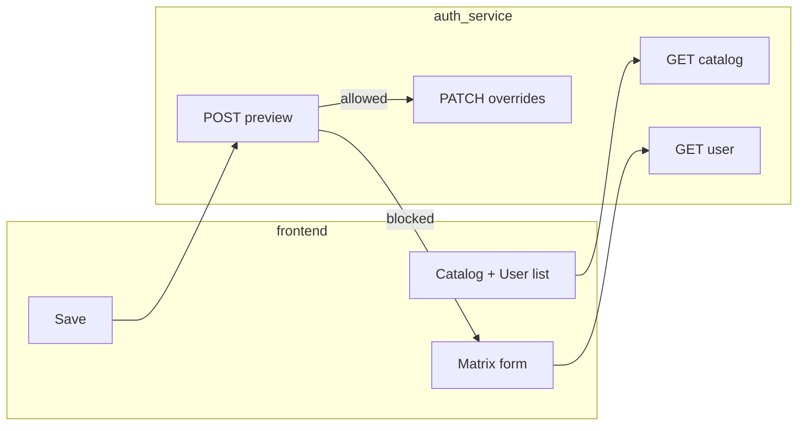

# Permission matrix — frontend / product ko samjha hua guide

**Kis ke liye:** tum (jo feature own kar rahe ho) **aur** jo bhi frontend developer isko implement karega.  
**Goal:** backend ne **kya** banaya, screen par **kya** dikhana hai, API se **kaise** jodna hai — bina assume kiye ki reader pehle se HRMS auth janta ho.

---

## 1. Problem kya solve ho rahi hai?

Pehle zyada tar jagah sirf **role** se kaam chal raha tha: `admin`, `hr`, `employee`, etc.  
Real duniya mein chahiye: **ek hi role** ke andar kisi user ko module A do, module B mat do — jaise **Petpooja** mein checkbox se rights dete ho.

Is feature ka matlab:

- **Catalog** = system mein jitne bhi “permissions” ho sakte hain unki **official list** (ek hi jagah se).
- **User par override** = us list se kuch **extra allow** (`custom_permissions`) ya **force deny** (`permission_denials`).
- **Effective** = jo permission **actually** lagegi: role + overrides − denies (ye calculation **server** karta hai).

Frontend ka kaam: **admin / hr / superadmin** ke liye ek screen jahan:

1. User select karo  
2. Catalog ke hisaab se checkboxes dikhao  
3. Save par server ko **do arrays** bhejo (allow extras + denies)  
4. Error / “tum ye right nahi de sakte” ko dikhao  

---

## 2. Backend ne tumhare liye kya tayyar kar diya?

Ye sab **auth-service** par hai (URL mein usually `https://api.etelios.com/api/permission/...`).

| Cheez | Simple matlab |
|--------|----------------|
| **GET /catalog** | UI ke sections + har permission ka `id` + `label` — matrix banane ke liye “master list” |
| **GET /users** | Tenant ke users ki list (table / search) |
| **GET /user/:userId** | **Ek user** ka pura hisaab: abhi ka role, custom, deny, **effective** list, aur **revision** number |
| **POST .../escalation-preview** | Save se pehle **dry-run**: “kya ye change allowed hai?” — bina DB change |
| **PATCH .../overrides** | **Poora replace**: naya `custom_permissions` + naya `permission_denials` ek saath |
| **PUT .../user/:id** | Incremental: `add` / `remove` / `replace` sirf custom list par |
| **POST .../reset** | Dono overrides hata do — wapas role jaisa |

**Kaun call kar sakta hai:** sirf roles **`superadmin`**, **`admin`**, **`hr`**. Baaki ko 403 milega — frontend mein bhi ye screen mat dikhao.

---

## 3. Login ke baad frontend ke paas kya hota hai?

User login karta hai → tumhe **access token** (JWT) milta hai.

Us token ke andar (abhi ke flow mein) roughly ye cheezein hoti hain:

- `userId`, `email`, `role`, `tenantId`, …  
- **`permRev`** — integer; jab bhi kisi user ki permissions DB mein change hoti hain ye number badhta hai  
- **`permissions`** — **optional** array: us waqt ka **effective** snapshot (bade token se bachne ke liye kabhi band bhi ho sakta hai env se)

**Frontend matrix admin screen** ke liye zaroori baat:

- **Dusre user** ki matrix edit karte waqt tum **login wale** token se API call karoge — matlab **admin/hr** ka token.  
- Jo user edit ho raha hai uska data **`GET /user/:userId`** se aata hai, login response se nahi.

---

## 4. Screen flow — ek dum seedha order

```
[Admin login]
     ↓
[Optional: GET /catalog]  →  left side groups + checkbox ids
     ↓
[GET /users]              →  user pick karo
     ↓
[GET /user/:chosenId]     →  abhi ki state + ETag / permissionsRevision
     ↓
[User ne checkboxes badle] →  local state mein do arrays maintain karo:
                             custom_permissions[], permission_denials[]
     ↓
[Save dabaya]
     ↓
[POST escalation-preview]  →  agar allowed: false → message dikhao, save mat karo
     ↓
[PATCH overrides]         →  If-Match header ke saath (niche explain)
```

**If-Match kyun?** Do admin ek saath same user khol ke save karein to overwrite na ho. Server **412** de sakta hai — tab bol do: “refresh karo, phir se save karo”.

---

## 5. Checkbox UI — dimag mein kaise map karein?

Do **sahi** tareeke:

### Tareeka A (recommended): do lists seedha API jaisa

- UI state = `custom_permissions[]` + `permission_denials[]`  
- **GET /user/:id** se jo `customPermissions` / `permissionDenials` aaye unse form bharo  
- **Effective** sirf read-only summary ke liye dikhao (“net result ye hai”)

### Tareeka B: har code ke liye “on/off”

- Har catalog `id` ke liye derived: allowed / denied / default  
- Save se pehle wapas **do arrays** mein convert karna padega — galti zyada hoti hai; isliye **preview** API use karna safe hai

Agar confusion ho: **Tareeka A** follow karo.

---

## 6. “Jo tumne SDK folder banaya hai” — woh kya hai?

Repo mein: **`integrations/permission-matrix-sdk/`**

Ye **alag npm package publish** nahi hai — idea yeh hai:

1. Poora folder apne **frontend repo** mein copy karo (jaise `src/lib/permission-admin/`).  
2. `permissionApi.ts` = plain **fetch** functions — koi magic nahi, bas URLs + headers sahi lagata hai.  
3. `usePermissionAdmin.ts` = **React hooks** — catalog load, user detail load, etc.

**Isse kya fayda?** Har baar URLs / headers manually na likho; copy-paste kam, typo kam.

**Zaroori nahi** SDK use karna — same cheez khud `fetch` se bhi ho sakti hai; SDK sirf **time bachane** ke liye hai.

---

## 7. Har API par exactly kya bhejna hai (copy mindset)

**Headers (almost har call):**

```http
Authorization: Bearer <access_token>
X-Tenant-Id: <tenant>    # agar tumhara gateway / app ye maangta hai
Content-Type: application/json   # POST/PATCH/PUT par
```

**PATCH /overrides body (dono array zaroori, khali `[]` chalega):**

```json
{
  "custom_permissions": ["read_payroll", "export_reports"],
  "permission_denials": ["delete_users"]
}
```

**POST escalation-preview (optional arrays — jo na bhejo woh “abhi DB jaisa hi rehne do”):**

```json
{
  "custom_permissions": ["read_payroll"],
  "permission_denials": []
}
```

**If-Match (PATCH / PUT / reset):**

```http
If-Match: W/"permrev-3"
```

Ye `3` **`GET /user/:id`** ke response se `permissionsRevision` ya response header **`ETag`** se lo.

---

## 8. Errors jo user ko dikhane hain

| Situation | User ko kya bolein |
|-----------|---------------------|
| 401 | Session khatam / dubara login |
| 403 + escalation message | “Ye permission tum assign nahi kar sakte — superadmin se bolo” |
| 412 | “Kisi ne pehle update kar diya — refresh karo” |
| 429 | “Bahut tez save kar rahe ho — thodi der baad try karo” |

---

## 9. Tumhare liye one-line summary (jo tum bol sako PM ko)

> “Humne **auth-service** par **permission catalog** + **per-user allow/deny overrides** + **save se pehle check** wali APIs daal di hain; **frontend** ko bas **admin screen** banana hai jo **catalog** dikha ke **PATCH** se save kare, aur **login token** + **tenant header** bheje.”

---

## 10. Aur detail kahan milegi?

| Doc | Kyun padhein |
|-----|----------------|
| [`PERMISSION_RBAC_MAJOR_UPDATE_E2E_FRONTEND_AND_PROD.md`](./PERMISSION_RBAC_MAJOR_UPDATE_E2E_FRONTEND_AND_PROD.md) | Poora technical end-to-end |
| [`PERMISSION_MATRIX_FRONTEND_INTEGRATION.md`](./PERMISSION_MATRIX_FRONTEND_INTEGRATION.md) | Chhota API cheat sheet |
| [`integrations/permission-matrix-sdk/README.md`](../integrations/permission-matrix-sdk/README.md) | SDK copy kaise karein |

---

## 11. Diagram (high level)



---

*Agar koi line ab bhi unclear ho, us line ka screenshot bhejo — usi line ko aur tod ke likh sakte hain.*
